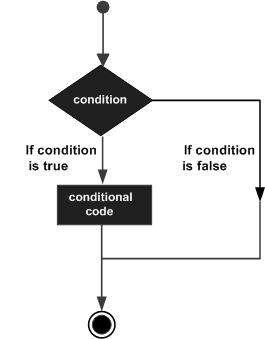

# If/Else

# **If/Else 조건문의 이해**

`if`, `else if`, `else` 문은 Solidity에서 조건부 논리를 구현하는 데 사용된다.

이 문법을 통해 특정 조건이 참일 때만 실행되는 코드를 만들 수 있으며, 조건에 따라 프로그램의 흐름을 다르게 제어할 수 있다.

스마트 컨트랙트에서는 다음과 같은 상황에서 자주 사용된다:

- 사용자의 잔액이 충분할 때만 거래를 실행하고자 할 때
- 특정 시간이 지난 이후에만 기능을 활성화하고자 할 때
- 특정 조건을 만족한 사용자에게만 접근을 허용하고자 할 때

조건문은 스마트 컨트랙트가 예외적인 상황을 사전에 방지하고, 예측 가능한 방식으로 작동하도록 만드는 데 중요한 역할을 한다.

### 조건문이 스마트 컨트랙트에서 중요한 이유:

스마트 컨트랙트는 한 번 배포되면 자동으로 실행되기 때문에, 잘못된 조건이나 예외 상황을 직접 다룰 수 없다. 따라서 코드 내부에서 미리 조건을 체크하고, **원하지 않는 상황이 발생하지 않도록** 방지하는 것이 매우 중요하다.  
특히, 배포된 스마트 컨트랙트는 수정이 불가능하므로, 처음부터 조건을 정확하게 설정하는 것이 매우 중요하다.

이제 if/else 문법의 구조와 함께 구체적인 사용 예시를 살펴보겠다.

### **if 문:**

```solidity

if (조건) {
    // 조건이 참일 때 실행되는 코드
}

```

→ 예: 어떤 값이 100보다 작을 때만 실행되는 코드가 있다면,

```solidity
if (x < 100) { ... }
```

형식으로 쓰면 된다.

### **if-else 문:**

```solidity

if (조건) {
    // 조건이 참일 때 실행되는 코드
} else {
    // 조건이 거짓일 때 실행되는 코드
}

```

→ 조건이 맞을 땐 위 블록이 실행되고, 조건이 맞지 않으면 아래 블록이 실행된다.



### **else if 문:**

```solidity

if (조건1) {
    // 조건1이 참일 때 실행되는 코드
} else if (조건2) {
    // 조건2가 참일 때 실행되는 코드
} else {
    // 위의 모든 조건이 거짓일 때 실행되는 코드
}

```

→ 여러 가지 조건을 순차적으로 확인하고, **처음으로 참인 조건 하나만 실행**된다.

## **예제 코드**

```solidity
// SPDX-License-Identifier: MIT
pragma solidity ^0.8.24;

contract IfElse {
    function foo(uint256 x) public pure returns (uint256) {
        if (x < 10) {
            return 0;
        } else if (x < 20) {
            return 1;
        } else {
            return 2;
        }
    }

    function ternary(uint256 y) public pure returns (uint256) {
        // if (y < 10) {
        //     return 1;
        // }
        // return 2;

        // if / else 조건문을 사용할 수 있는 더 간단한 방법
        // "?" 연산자는 ternary operator라고 불린다.
        return y < 10 ? 1 : 2;
    }
}

```

If Else 컨트랙트에는 두 개의 함수가 포함되어 있다: foo 함수와 ternary 함수. 각각의 함수는 함수 내에서 if/else 문을 사용해 설정한 조건에 따라 값을 반환한다.

### **foo 함수**

```solidity

function foo(uint256 x) public pure returns (uint256) {
    if (x < 10) {
        return 0;
    } else if (x < 20) {
        return 1;
    } else {
        return 2;
    }
}

```

이 함수는 x라는 정수형(uint256) 입력값을 받으며 함수의 반환값은 uint256 타입이다.

조건에 따라 다른 값을 반환한다:

1. x가 10보다 작으면 0을 반환한다. (if문의 조건을 만족하는 경우)
2. x가 10보다 크거나 같고 20보다 작으면 1을 반환한다. (else if문의 조건을 만족하는 경우)
3. x가 20보다 크거나 같으면 2를 반환한다. (위의 두 조건을 모두 만족하지 않는 경우)

### **ternary 함수**

```solidity

function ternary(uint256 y) public pure returns (uint256) {
    // if (y < 10) {
    //     return 1;
    // }
    // return 2;

    // if / else 조건문을 사용할 수 있는 더 간단한 방법
    // "?" 연산자는 ternary operator라고 불린다.
    return y < 10 ? 1 : 2;
}

```

이 함수는 y라는 정수형(uint256) 입력값을 받으며 함수의 반환값은 마찬가지로 uint256 타입이다.

이 코드에서는 삼항 연산자(ternary operator)를 사용하여 주석 처리된 동일한 논리의 코드보다 간결하게 작성했다.

삼항 연산자는 ?와 :를 사용하여 if-else 문을 축약하여 작성하는 방식이다.

코드의 조건문은 y < 10 조건이 참이면 1을 반환하고, 거짓이면 2를 반환한다.

### ※ 삼항 연산자란?

```solidity

조건 ? 참일 때 값 : 거짓일 때 값
```

> 즉, return (y < 10) ? 1 : 2;는
> 
> 
> `if (y < 10) { return 1; } else { return 2; }`와 완전히 똑같다.
>