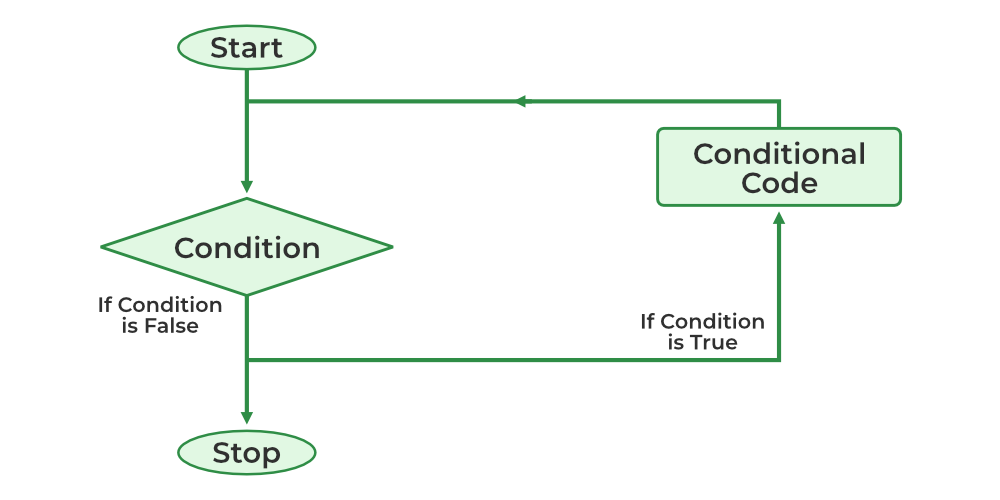

# Loop

반복문은 특정 코드를 **여러 번 반복해서 실행하고자 할 때** 사용하는 문법이다.

Solidity에서 반복문은 주어진 조건이 참인 동안 동일한 코드 블록을 반복적으로 실행하게 만든다.

반복문은 크게 세 가지 방식으로 나뉜다:

- `while` 문: 조건이 참인 동안 계속 반복하고자 할 때 사용된다.
- `do-while` 문: 조건과 상관없이 코드 블록을 **최소 한 번은 실행한 뒤**, 조건이 참이면 반복을 계속한다.
- `for` 문: 반복 횟수가 명확할 때 사용된다.



### <기본적인 반복문의 개념>

스마트 컨트랙트에서 반복문은 다음과 같은 상황에서 활용된다:

- 배열이나 리스트에 있는 여러 데이터를 하나씩 순회하며 처리하고자 할 때
- 특정 조건을 만족할 때까지 작업을 반복하고자 할 때
- 반복적으로 어떤 값들을 계산하고 누적할 필요가 있을 때

다만, Solidity는 **가스 비용**이라는 제약이 있기 때문에, 반복문을 사용할 때는 항상 실행 횟수를 제한하거나, 과도한 반복이 발생하지 않도록 주의해야 한다.

반복문은 코드의 효율성과 재사용성을 높여주는 유용한 도구이지만, 동시에 무한 반복이나 높은 가스 소비로 이어질 수 있으므로, **신중하게 사용하는 것이 중요하다**.

이제 반복문의 기본 구조와 사용 예시에 대해 살펴보겠다.

# **While loop**

While문은 Solidity에서 가장 기본적인 반복문이다. 괄호 안의 조건이 true인 경우 계속해서 안의 내용을 반복하여 실행하고, 조건이 false가 되면 루프가 종료된다.

## **Syntax**

```solidity

uint256 j;
while (j < 10) {
    j++;
}

```

이 코드는 `while` 반복문의 기본 구조를 보여주는 예시이다.

첫 번째 줄에서 `j`라는 이름의 `uint256` 타입 변수를 선언한다.

Solidity에서는 변수를 선언하면 초기값이 자동으로 `0`으로 설정되므로, `j`는 처음에 `0`부터 시작하게 된다.

그 다음 줄에서 `while (j < 10)`이라는 조건이 설정되어 있다.

이 조건은 `j`가 10보다 작은 동안에는 루프 안의 코드를 계속 반복하겠다는 뜻이다.

즉, `j`가 0부터 시작해서 10보다 작을 때까지, 안쪽 코드 블록이 반복해서 실행된다.

코드 블록 내부에는 `j++`이라는 문장이 있다.

이는 `j = j + 1`과 같은 의미로, `j`의 값을 1씩 증가시키는 역할을 한다.

결과적으로 이 반복문은 `j`의 값이 0에서 시작해 1씩 증가하면서, `j < 10`이라는 조건이 거짓이 될 때까지, 즉 `j`가 10이 될 때까지 반복된다.

조건이 처음부터 `false`라면 한 번도 실행되지 않고 넘어가며, 조건이 `true`일 때만 반복된다.

이 구조는 반복 횟수를 사전에 정하기 어려울 때, 조건에 따라 반복 여부를 동적으로 결정하고자 할 때 유용하게 사용된다.

# **Do-While loop**

do-while 문은 조건이 참일 때 반복문의 본문을 실행하고, 반복이 끝난 후에 조건을 확인한다. 조건을 만족하는지 체크하기 전에 먼저 do 안에 있는 본문이 실행되기 때문에, 본문이 최소한 한 번은 실행되어야 하는 경우에 유용하다.

## **Syntax**

```solidity

do{
    j++;
    data.push(j);
    } while(j < 5) ;

```

이 코드는 `do-while` 반복문의 기본 구조를 보여주는 예시이다.

`do-while` 문은 일반적인 `while` 문과 달리, **조건을 확인하기 전에 본문을 먼저 실행**한다는 특징이 있다.

즉, 조건이 거짓이더라도 최소 한 번은 코드 블록이 실행된다.

첫 줄의 `do {`는 반복문의 시작을 나타낸다.

그 안에는 두 개의 명령이 들어 있다:

1. `j++`: 변수 `j`의 값을 1 증가시킨다.
2. `data.push(j)`: 증가된 `j`의 값을 배열 `data`에 추가(push)한다.

이후 `while (j < 5);` 구문에서 조건을 검사한다.

조건이 참이면 다시 `do` 블록으로 돌아가고, 거짓이 되면 반복문을 종료한다.

예를 들어, `j`가 처음에 `4`라면, 이 코드는 다음과 같이 작동한다:

- 먼저 `j`를 5로 증가시키고, `data` 배열에 5를 추가한다.
- 그 다음 조건 `j < 5`를 검사하게 되는데, 이때는 조건이 거짓이므로 반복을 종료한다.
- 결과적으로 코드 블록은 단 **한 번만 실행되고 종료**된다.

이런 구조는 반복 실행 여부와 무관하게 **본문을 무조건 한 번은 실행해야 하는 상황**에서 유용하게 사용된다.

예를 들어, 사용자 입력을 한 번 받고, 그 입력값을 기준으로 반복 여부를 결정해야 할 때 활용된다.

# **For loop**

for 반복문은 while 반복문보다는 복잡하지만 가장 많이 쓰이는 반복문이다. for 문은 3가지 인자가 세미콜론으로 구분되어 작동된다.3개의 인자는 각각 초기화식, 조건식 , 증감식으로 구성된다. 초기화 식은 반복문에 사용 될 변수를 정의하고 초기화한다. 조건식에서는 반복문이 반복 될 때마다 조건이 true인지를 확인하며 false일 경우 반복문을 탈출하게 된다. 반복문의 매 반복마다 증감식을 적용한 후, 조건식을 평가하게 된다.

```solidity

for(초기화식; 조건식; 증감식){}

```

## **Syntax**

```solidity

for(uint i=0; i<5; i++){
        data.push(i);
     }

```

이 코드는 Solidity에서 가장 일반적으로 사용되는 `for` 반복문의 기본 구조를 보여주는 예시이다.

`for` 문은 한 줄 안에 **반복에 필요한 모든 구성요소**를 담고 있으며, 세미콜론(`;`)으로 구분된 **세 개의 인자**로 구성된다:

1. **초기화식 (`uint i = 0`)**
    
    반복문에서 사용할 변수 `i`를 선언하고 초기값을 설정한다. 이 경우 `i`는 0부터 시작된다.
    
2. **조건식 (`i < 5`)**
    
    매 반복마다 이 조건을 검사한다.
    
    조건이 참이면 코드 블록을 실행하고, 거짓이면 반복문을 종료한다.
    
3. **증감식 (`i++`)**
    
    코드 블록이 한 번 실행된 뒤에 수행되는 부분이다.
    
    여기서는 `i`를 1씩 증가시키는 역할을 한다.
    

본문인 `data.push(i)`는 반복문이 실행될 때마다 배열 `data`에 현재 `i` 값을 추가한다.

즉, `i`가 0부터 4까지 변하면서, `data`에는 0, 1, 2, 3, 4가 차례대로 들어가게 된다.

반복 순서를 요약하면 다음과 같다:

1. 변수 `i`를 0으로 초기화한다.
2. `i < 5` 조건을 검사한다.
3. 조건이 참이면 `data.push(i)`를 실행한다.
4. 이후 `i++`를 통해 `i` 값을 1 증가시킨다.
5. 다시 조건을 검사하고, 이 과정을 반복한다.
6. 조건이 거짓이 되면 반복을 종료한다.

`for` 문은 반복 횟수가 명확할 때 가장 직관적이고 간결하게 사용할 수 있어, 스마트 컨트랙트에서 배열 순회나 반복 계산을 수행할 때 자주 사용된다.

## **예제 코드**

```solidity
// SPDX-License-Identifier: MIT
pragma solidity ^0.8.24;

contract ForLoopExample {
    // 배열 선언, 배열은 Array 파트에서 배우게 된다.
    uint[] public numbers = [1,2,3,4];

    // 배열에 저장된 숫자들의 합을 계산하는 함수
    function sumNumbers() public view returns (uint) {
        uint sum = 0;
        // for 루프를 사용하여 배열의 각 요소를 합산
        for (uint i = 0; i < numbers.length; i++) {
            sum += numbers[i];
        }
        return sum;
    }
}
```

이 코드는 `for` 반복문을 활용하여 배열에 저장된 값들의 **합계를 계산하는** 예시를 보여준다.

`contract ForLoopExample`은 하나의 스마트 컨트랙트이며, 그 안에는 배열과 함수를 포함하고 있다.

---

### `numbers` 배열

```solidity

uint[] public numbers = [1,2,3,4];
```

- `uint[]`는 `uint` 타입의 요소들을 담는 **동적 배열**이다.
- `public` 키워드를 사용했기 때문에, 이 배열은 누구나 외부에서 조회할 수 있다.
- 배열에는 1, 2, 3, 4의 네 개의 숫자가 들어 있으며, 이 배열의 길이는 4이다.

---

### `sumNumbers()` 함수

```solidity

function sumNumbers() public view returns (uint)
```

- 이 함수는 배열에 들어 있는 모든 숫자의 **합계를 계산**하여 반환한다.
- `view` 키워드를 사용하여, 상태 변경 없이 **배열을 읽기만** 한다.
- 반환값의 타입은 `uint`이며, 합산 결과를 의미한다.

---

### 반복문 부분

```solidity
uint sum = 0;
for (uint i = 0; i < numbers.length; i++) {
    sum += numbers[i];
}

```

- `sum`이라는 변수를 0으로 초기화하고, 여기에 배열의 값을 하나씩 더해 나간다.
- `for` 반복문은 인덱스 `i`를 0부터 시작하여, `numbers.length`보다 작을 동안 반복한다.
    
    → `numbers.length`는 배열의 길이이므로 여기서는 4이다.
    
- 반복문의 본문에서 `numbers[i]`를 가져와 `sum`에 누적시킨다.

반복 과정은 다음과 같이 진행된다:

| i 값 | numbers[i] | 누적 합 (sum) |
| --- | --- | --- |
| 0 | 1 | 0 + 1 = 1 |
| 1 | 2 | 1 + 2 = 3 |
| 2 | 3 | 3 + 3 = 6 |
| 3 | 4 | 6 + 4 = 10 |

마지막으로 `sum`의 값을 반환하게 되며, 이 함수의 최종 결과는 `10`이 된다.