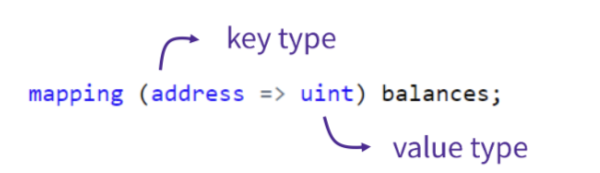
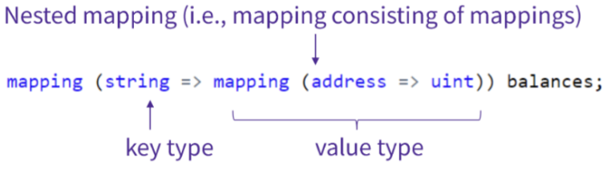

# Mapping

`mapping`은 다른 언어의 해시 테이블 또는 딕셔너리와 유사한 자료 구조이다.

Solidity에서 `mapping`은 **특정 키(key)에 대응되는 값(value)를 저장**하는 구조로, **키-값 쌍(key-value pair)** 형태로 데이터를 다룬다.

이 구조에서 키는 고유(unique)해야 하며, 하나의 키는 오직 하나의 값에만 매핑된다.

즉, 같은 키에 여러 값을 저장할 수 없으며, 기존 값을 덮어쓰게 된다.

### 사용 목적

`mapping`은 다음과 같은 상황에서 유용하게 사용된다:

- 주소(address)마다 토큰 잔액을 저장하고 싶을 때
- 사용자별 등록 상태나 권한을 저장하고 싶을 때
- 빠르게 값을 조회하거나 특정 데이터를 직접 접근하고 싶을 때

스마트 컨트랙트에서는 배열보다 `mapping`을 더 많이 사용하는 경우가 많다.

그 이유는 키를 직접 지정하여 **빠르게 데이터에 접근할 수 있고**, 불필요한 전체 순회 없이 필요한 값만 조회할 수 있기 때문이다.

---

## **기본 구문**

`mapping`을 선언하는 기본 구문은 다음과 같다.

```solidity

mapping(keyType => valueType) public myMapping;
```

여기서 `keyType`은 매핑의 키 타입을, `valueType`은 매핑의 값 타입을 나타낸다.

예를 들어, `uint`를 키로 하고 `string`을 값으로 하는 매핑은 다음과 같이 선언할 수 있다.

```solidity

mapping(uint => string) public myMapping;
```

이 매핑은 `0`, `1`, `2` 같은 정수 키에 `"apple"`, `"banana"` 같은 문자열 값을 연결하여 저장할 수 있다.

`public` 키워드를 사용하면 자동으로 getter 함수가 생성되어, 외부에서 값을 조회할 수 있다.



---

## **특징**

1. **키-값 저장**
    
    `mapping`은 특정 키와 그 키에 대응하는 값을 저장한다.
    
    예를 들어 `mapping(address => uint)`는 각 사용자 주소(`address`)에 대해 숫자 값(`uint`)을 저장할 수 있다.
    
    이 구조를 이용하면 주소별 잔액, 포인트, 점수 등을 쉽게 관리할 수 있다.
    
2. **빠른 조회**
    
    `mapping`은 해시 테이블처럼 작동하기 때문에, 키를 통해 원하는 값을 빠르게 찾아낼 수 있다.
    
    스마트 컨트랙트에서는 연산 비용과 속도가 중요한데, `mapping`은 이러한 점에서 매우 효율적인 구조이다.
    
3. **디폴트 값 반환**
    
    존재하지 않는 키를 조회하면, 해당 값 타입(`valueType`)에 맞는 기본값(default value)을 반환한다.
    
    예를 들어 `mapping(address => uint)`에서 저장되지 않은 주소를 조회하면, 자동으로 `0`이 반환된다.
    
    이는 존재 여부만으로 판단해서는 안 되고, 실제로 값을 설정했는지를 별도로 확인해야 함을 의미한다.
    

## **예제 코드**

```solidity
// SPDX-License-Identifier: MIT
pragma solidity ^0.8.24;

contract Mapping {
    // 각 주소에 uint 값을 저장하는 mapping을 선언
    mapping(address => uint256) public myMap;

    function get(address _addr) public view returns (uint256) {
        // 매개변수로 입력 받은 주소에 저장된 uint 값을 불러오는 함수이다.
        // 만약 값이 저장되어 있지 않다면, 기본 값이 reutrn 된다.
        return myMap[_addr];
    }

    function set(address _addr, uint256 _i) public {
        // 매개변수의 첫번째 인자로 입력받은 주소에 두번째 인자로 입력받은 값 _i를 저장한다.
        myMap[_addr] = _i;
    }

    function remove(address _addr) public {
        // 매개변수로 입력받은 주소에 저장된 값을 삭제시키고 기본 값으로 초기화한다.
        delete myMap[_addr];
    }
}

contract NestedMapping {
    // 중첩 mapping (주소에 또 다른 mapping을 저장, 즉, mapping안에 mapping을 넣는 방식이다.)
    // 이 mappinp은 주소와 uint로 bool 값을 저장할 수 있다.
    mapping(address => mapping(uint256 => bool)) public nested;

    function get(address _addr1, uint256 _i) public view returns (bool) {
        // 겉의 mapping의 키(주소)를 입력받고, 안의 mapping의 키(_i)를 입력받아 값을 불러올 수 있다.
        // 초기화 되지 않은 경우에도 가능하다.
        return nested[_addr1][_i];
    }

    function set(address _addr1, uint256 _i, bool _boo) public {
        nested[_addr1][_i] = _boo;
    }

    function remove(address _addr1, uint256 _i) public {
        delete nested[_addr1][_i];
    }
}

```

## **예제 코드 해설**

이 코드는 두 개의 스마트 컨트랙트를 포함하고 있으며, 각각 `Mapping`과 `NestedMapping`이라는 이름을 가지고 있다.

두 컨트랙트 모두 `mapping`을 사용하는 예제를 포함하고 있으며, 각각 **단순 매핑**과 **중첩 매핑**의 개념을 보여준다.

---

### **Mapping 컨트랙트**

이 컨트랙트는 `address` 타입의 키에 대해 `uint256` 값을 저장하는 간단한 매핑을 다룬다.

### 변수

```solidity
mapping(address => uint256) public myMap;
```

- 주소(`address`)를 키로 사용하고, 해당 주소에 대응되는 값을 `uint256` 타입으로 저장하는 공개 매핑이다.
- `public` 키워드가 붙어 있기 때문에, 자동으로 getter 함수가 생성되어 외부에서 특정 주소의 값을 쉽게 조회할 수 있다.

### 함수

1. **값 조회 함수**

```solidity

function get(address _addr) public view returns (uint256) {
    return myMap[_addr];
}

```

- 매개변수로 전달된 주소 `_addr`에 저장된 값을 반환한다.
- 해당 주소에 값이 한 번도 설정된 적이 없을 경우, `uint256` 타입의 기본값인 `0`이 반환된다.
- 상태를 변경하지 않기 때문에 `view` 함수로 선언되어 있다.
1. **값 설정 함수**

```solidity

function set(address _addr, uint256 _i) public {
    myMap[_addr] = _i;
}

```

- 특정 주소 `_addr`에 대해, 전달된 정수 값 `_i`를 저장한다.
- 같은 주소에 대해 다시 값을 설정하면, 기존 값은 덮어쓰기 된다.

2. **값 삭제 함수**

```solidity

function remove(address _addr) public {
    delete myMap[_addr];
}

```

- 입력된 주소 `_addr`에 해당하는 값을 삭제한다.
- `delete` 키워드를 사용하면 해당 값은 자동으로 기본값인 `0`으로 초기화된다.

---

### **NestedMapping 컨트랙트**

이 컨트랙트는 **중첩 매핑(nested mapping)**을 사용하여 복잡한 구조의 데이터를 저장하고 관리한다.

중첩 매핑이란, **매핑 안에 또 다른 매핑을 값으로 넣는 구조**를 의미한다.



### 변수

```solidity

mapping(address => mapping(uint256 => bool)) public nested;

```

- 가장 바깥쪽 매핑은 주소(`address`)를 키로 사용한다.
- 각 주소는 내부적으로 또 다른 매핑을 값으로 가진다.
- 내부 매핑은 `uint256`을 키로 하고, `bool` 값을 저장한다.
- 즉, `(주소, 정수)` 쌍에 대해 `true` 또는 `false`를 저장할 수 있는 구조이다.

### 함수

1. **값 조회 함수**

```solidity

function get(address _addr1, uint256 _i) public view returns (bool) {
    return nested[_addr1][_i];
}

```

- 주소 `_addr1`과 정수 `_i`에 대응되는 `bool` 값을 반환한다.
- 값이 설정되지 않은 경우, `bool` 타입의 기본값인 `false`가 자동으로 반환된다.

1. **값 설정 함수**

```solidity

function set(address _addr1, uint256 _i, bool _boo) public {
    nested[_addr1][_i] = _boo;
}

```

- 주소 `_addr1`과 정수 `_i`에 대해 `bool` 값 `_boo`를 저장한다.
- 이 구조를 사용하면 예를 들어, 특정 사용자가 특정 항목을 허용했는지, 권한을 부여받았는지 등을 관리할 수 있다.

1. **값 삭제 함수**

```solidity

function remove(address _addr1, uint256 _i) public {
    delete nested[_addr1][_i];
}

```

- 입력된 주소 `_addr1`과 정수 `_i`에 해당하는 값을 삭제한다.
- 삭제된 값은 자동으로 기본값인 `false`로 초기화된다.