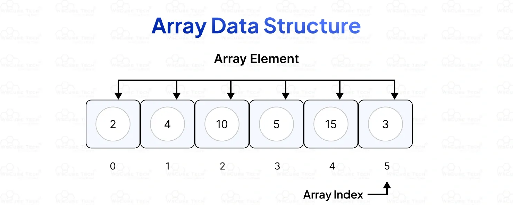

# Array

Solidity에서 `array`는 **동일한 자료형의 값들을 순차적으로 저장하는 자료 구조**이다.

배열을 사용하면 여러 개의 값을 하나의 변수로 묶어서 관리할 수 있어 코드의 간결성과 처리 효율을 높일 수 있다.



Solidity에서는 배열을 두 가지 형태로 선언할 수 있다:

---

### **Fixed-size Array**

- 고정된 크기의 배열로, 선언 시 크기를 명확히 지정해야 한다.
- 배열의 크기는 이후에 변경할 수 없으며, 요소를 추가하거나 삭제하는 `push`, `pop` 함수도 사용할 수 없다.
- 반복문 등에서 배열의 길이를 명확히 알고 있어야 하는 경우에 적합하다.

```solidity
uint[3] public fixedArray = [1, 2, 3];

```

- 위 예시에서 배열의 크기는 3으로 고정되어 있으며, 항상 3개의 요소만 저장할 수 있다.

---

### **Dynamic Array**

- 크기가 정해져 있지 않은 배열로, 실행 중에 요소를 자유롭게 추가하거나 제거할 수 있다.
- `push()`를 사용하여 요소를 추가할 수 있으며, `pop()`을 사용하여 마지막 요소를 제거할 수 있다.
- 동적으로 변화하는 데이터를 다루는 데 유용하다.

```solidity

uint[] public dynamicArray;

function addElement(uint _value) public {
    dynamicArray.push(_value);
}
```

- 위 예시처럼 `push` 함수를 통해 배열에 값을 계속 추가할 수 있다.

---

### **Array의 특성**

배열을 사용할 때는 **저장 위치(storage location)**도 중요하게 작용한다.

Solidity에서는 배열을 저장할 때 `storage`와 `memory` 키워드를 사용하여 위치를 지정할 수 있다.

1. **storage**
    - 영구적으로 블록체인에 저장되는 공간이다.
    - 상태 변수로 선언된 배열은 기본적으로 `storage`에 저장된다.
    - 가스 비용이 높지만 데이터를 오래 보관할 수 있다.
2. **memory**
    - 함수 실행 중에만 존재하는 임시 저장 공간이다.
    - 함수 내에서 일시적으로 배열을 다룰 때 사용된다.
    - 함수가 종료되면 자동으로 사라지며, 가스 비용이 비교적 적다.

```solidity

function process(uint[] memory tempArray) public pure returns (uint) {
    return tempArray.length;
}
```

- 위 함수는 `memory` 배열을 받아 해당 배열의 길이를 반환하는 예시이다.

---

배열은 반복문과 함께 자주 사용되며, `mapping`과 달리 **순회(iteration)**가 가능하다는 특징이 있다.

이제 배열을 선언하고 사용하는 실제 예제를 통해 구조를 더 자세히 살펴보겠다.

## **예제 코드**

```solidity
// SPDX-License-Identifier: MIT
pragma solidity ^0.8.24;

contract Array {
    // Array를 초기화하는 여러가지 방법입니다.
    uint256[] public arr;
    uint256[] public arr2 = [1, 2, 3];
    // 고정된 크기의 array는 모든 값이 0으로 초기화된다.
    uint256[10] public myFixedSizeArr;

    // i번째 index에 있는 array 값 반환하는 함수이다.
    function get(uint256 i) public view returns (uint256) {
        return arr[i];
    }

    // Solidity에서는 array 전체를 반환할 수 있다.
    // Array의 길이가 굉장히 커질 수 있어서 사용하지 않는 것을 추천한다.
    function getArr() public view returns (uint256[] memory) {
        return arr;
    }

    function push(uint256 i) public {
        // python에서 append와 비슷한 함수다.
        // array 마지막에 값을 추가하고, array의 길이는 1증가한다.
        arr.push(i);
    }

    function pop() public {
        // python에서 pop과 비슷한 함수다.
        // array의 마지막 값을 삭제하고, array의 길이는 1 감소한다.
        arr.pop();
    }

    // array의 길이를 반환하는 함수다.
    function getLength() public view returns (uint256) {
        return arr.length;
    }

    function remove(uint256 index) public {
        // delete는 array 길이에 영향을 주지 않다.
        // 기존에 있었던 값으로 reset한다, 이 경우에는 0으로 값이 바뀐다.
        delete arr[index];
    }
}

```

이 코드는 `Solidity`에서 배열(Array)을 선언하고, 다양한 방식으로 **조회**, **추가**, **삭제**하는 기본적인 기능들을 보여주는 예제이다.

배열에는 **동적 배열**과 **고정 크기 배열** 두 가지가 모두 포함되어 있다.

---

### **Array 초기화 방법**

1. `uint256[] public arr;`
    - 비어 있는 동적 배열을 선언한다.
    - `public` 키워드가 붙어 있으므로 자동으로 getter 함수가 생성된다.
2. `uint256[] public arr2 = [1, 2, 3];`
    - `[1, 2, 3]`으로 초기화된 동적 배열을 선언한다.
3. `uint256[10] public myFixedSizeArr;`
    - 길이가 10으로 고정된 배열을 선언한다.
    - 고정 크기 배열은 선언 시 모든 요소가 `0`으로 초기화된다.

---

### **get 함수**

```solidity

function get(uint256 i) public view returns (uint256) {
    return arr[i];
}
```

- 배열 `arr`의 `i`번째 인덱스에 해당하는 값을 반환한다.
- 배열은 0부터 시작하는 인덱스를 가지며, 유효하지 않은 인덱스를 입력할 경우 에러가 발생한다.

---

### **getArr 함수**

```solidity

function getArr() public view returns (uint256[] memory) {
    return arr;
}
```

- 배열 전체를 반환한다.
- 단, 배열의 크기가 매우 클 경우 **가스 비용이 급격히 증가**할 수 있으므로, 일반적인 상황에서는 사용을 지양하는 것이 좋다.

---

### **push 함수**

```solidity

function push(uint256 i) public {
    arr.push(i);
}
```

- 배열의 맨 끝에 새로운 요소 `i`를 추가한다.
- 배열의 길이가 1 증가하게 된다.
- 이는 Python의 `append()` 함수와 유사한 역할을 한다.

---

### **pop 함수**

```solidity

function pop() public {
    arr.pop();
}
```

- 배열의 마지막 요소를 제거한다.
- 배열의 길이가 1 감소한다.
- Python의 `pop()` 함수와 비슷한 동작을 한다.

---

### **getLength 함수**

```solidity

function getLength() public view returns (uint256) {
    return arr.length;
}
```

- 현재 배열의 길이(요소 개수)를 반환한다.
- 이 값을 통해 반복문의 종료 조건 등을 설정할 수 있다.

---

### **remove 함수**

```solidity

function remove(uint256 index) public {
    delete arr[index];
}
```

- 배열에서 특정 인덱스의 값을 삭제한다.
- 단, 이때 **배열의 길이는 줄어들지 않고 그대로 유지**된다.
- 삭제된 인덱스의 값은 `uint256` 타입의 **기본값인 0으로 초기화**된다.
- 이 작업은 실제로 배열에서 요소를 제거하기보다는 값을 초기화시키는 동작에 가깝다.