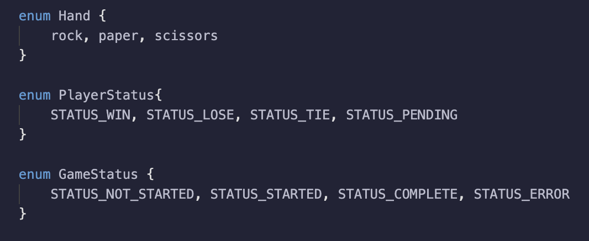

# Enum


Solidity에서 `enum`은 여러 상태나 선택지를 표현하기 위해 사용되는 사용자 정의 데이터 타입이다.

여러 개의 의미 있는 이름들을 하나의 묶음으로 정의함으로써, 코드의 **가독성**과 **상태 관리의 명확성**을 높일 수 있다.

스마트 컨트랙트에서는 특정 프로세스의 상태를 구분하거나, 정해진 범위 내의 값만 사용해야 할 때 `enum`이 유용하게 사용된다.



---

### **Enum의 정의 및 사용**

### Enum 정의

`enum`은 스마트 컨트랙트 내에서 다음과 같은 형식으로 정의된다:

```solidity

enum <이름> {
    <값1>,
    <값2>,
    <값3>,
    ...
}
```

- 각 값은 내부적으로 0부터 시작하는 정수로 자동 매핑된다.
- 예를 들어, 아래와 같이 정의하면:

```solidity

enum Status {
    Pending,
    Shipped,
    Accepted,
    Rejected,
    Canceled
}
```

- `Status.Pending`은 `0`,
    
    `Status.Shipped`는 `1`,
    
    `Status.Accepted`는 `2` … 와 같이 정수로 처리된다.
    

이러한 구조를 통해 특정 상태를 의미 있는 이름으로 표현할 수 있어, 코드 해석이 더 쉬워진다.

---

### **Enum 선언 및 가져오기**

Solidity에서는 `enum`을 하나의 파일에 정의하고, 이를 다른 컨트랙트 파일에서 가져와 사용할 수 있다.

이 방식은 코드의 재사용성과 모듈화를 가능하게 한다.

### Enum 선언 파일 예시 (`EnumDeclaration.sol`)

```solidity

// SPDX-License-Identifier: MIT
pragma solidity ^0.8.24;

// Enum 선언
enum Status {
    Pending,
    Shipped,
    Accepted,
    Rejected,
    Canceled
}
```

- `Status`라는 이름의 enum을 정의하였다.
- 다섯 가지 상태를 의미 있는 이름으로 표현하고 있다.
- 이 enum은 외부 파일에서도 import하여 사용할 수 있다.

### Enum 가져오기 예시

```solidity
// SPDX-License-Identifier: MIT
pragma solidity ^0.8.24;

import "./EnumDeclaration.sol";

contract Enum {
    Status public status;
}
```

- `import` 문을 통해 외부 파일에서 정의한 `Status` enum을 가져온다.
- 컨트랙트 내부에서 `status`라는 상태 변수를 선언하여 enum 타입으로 사용한다.
- 상태 값은 `status = Status.Pending`과 같은 방식으로 설정할 수 있다.

---

### **enum의 장점**

1. **가독성 향상**
    - 정수 대신 의미 있는 이름을 사용하여, 코드의 목적을 더 쉽게 파악할 수 있다.
    - 예: `status = Status.Accepted`은 `status = 2`보다 훨씬 직관적이다.
2. **코드 안전성 증가**
    - 정해진 값 중 하나만 설정할 수 있으므로, **잘못된 숫자나 상태가 입력되는 실수를 줄일 수 있다**.
3. **기본값 설정**
    - `enum` 변수는 별도로 초기화하지 않아도 자동으로 첫 번째 값으로 설정된다.
    - 예를 들어, 위의 `Status` enum에서는 `Pending`이 기본값이 된다.
4. **메모리 효율성**
    - 내부적으로는 정수(integer)로 처리되므로, **저장 공간을 절약**할 수 있다.

### **예제 코드**

```solidity
// SPDX-License-Identifier: MIT
pragma solidity ^0.8.24;

contract Enum {
    // 배송 상태를 나타내는 Enum 정의
    enum Status {
        Pending,   // 0
        Shipped,   // 1
        Accepted,  // 2
        Rejected,  // 3
        Canceled   // 4
    }

    // 기본값은 Enum 정의의 첫 번째 값으로 설정됩니다. 여기서는 "Pending"
    Status public status;

    // 상태 값을 반환하는 함수
    function get() public view returns (Status) {
        return status;
    }

    // 상태 값을 업데이트하는 함수
    function set(Status _status) public {
        status = _status;
    }

    // 특정 Enum 값으로 상태를 업데이트하는 함수
    function cancel() public {
        status = Status.Canceled;
    }

    // 상태를 초기값으로 재설정하는 함수
    function reset() public {
        delete status; // 기본값인 Pending으로 재설정
    }
}

```

이 코드는 `enum`을 사용하여 배송 상태를 관리하는 기본적인 스마트 컨트랙트를 구현한 예제이다.

총 다섯 가지의 배송 상태를 정의하고, 이를 바탕으로 상태를 **조회** ,**설정**, **특정 값으로 변경**, **초기화**하는 기능

을 포함하고 있다.

### **Enum 정의 및 상태 변수**

```solidity

enum Status {
    Pending,
    Shipped,
    Accepted,
    Rejected,
    Canceled
}
Status public status;
```

- `Status`는 배송 상태를 나타내는 `enum` 타입이다.
- `Pending`은 초기 상태이며 내부적으로 정수값 `0`으로 처리된다.
- `status` 변수는 상태를 저장하는 `public` 변수이며, 외부에서 조회가 가능하다.

---

### **get 함수**

```solidity

function get() public view returns (Status) {
    return status;
}
```

- 현재 상태 값을 반환하는 함수이다.
- 상태는 `enum` 타입 그대로 반환되며, 정수값(예: `0`, `1`)이 아닌 **명시적인 상태 이름**으로 확인할 수 있다.

---

### **set 함수**

```solidity

function set(Status _status) public {
    status = _status;
}
```

- 상태 값을 직접 변경하는 함수이다.
- 함수 인자로 전달된 `Status` 타입의 `_status` 값을 받아서 현재 상태에 할당한다.
- 예를 들어 `_status`에 `Status.Shipped`를 전달하면 상태가 `Shipped`로 바뀐다.

---

### **cancel 함수**

```solidity

function cancel() public {
    status = Status.Canceled;
}
```

- 상태를 `Canceled`로 명시적으로 설정하는 함수이다.
- 매개변수 없이 실행되며, 배송이 취소되었을 때 호출할 수 있다.

---

### **reset 함수**

```solidity

function reset() public {
    delete status;
}
```

- 상태를 초기값으로 되돌리는 함수이다.
- `delete` 키워드를 사용하면, `enum` 변수는 정의된 첫 번째 값으로 초기화된다.
- 이 경우 `Pending`으로 리셋된다.

---

## **기능 확인**

1. **초기 상태 확인**
    - 컨트랙트를 배포한 직후 `get()` 함수를 호출하면 `Pending` 상태(정수값 0)가 반환된다.
2. **상태 업데이트**
    - `set()` 함수에 `1`을 입력하면 상태가 `Shipped`로 변경된다.
        
        (`Status.Shipped`는 내부적으로 1에 해당한다)
        
3. **특정 상태로 직접 설정**
    - `cancel()` 함수를 호출하면 상태가 `Canceled`로 변경된다.
        
        이는 명시적으로 `Status.Canceled` 값을 할당한 것이다.
        
4. **상태 초기화**
    - `reset()` 함수를 호출하면 상태가 다시 `Pending`으로 되돌아간다.
        
        이는 `delete`에 의해 `enum`의 첫 번째 값으로 자동 초기화되기 때문이다.