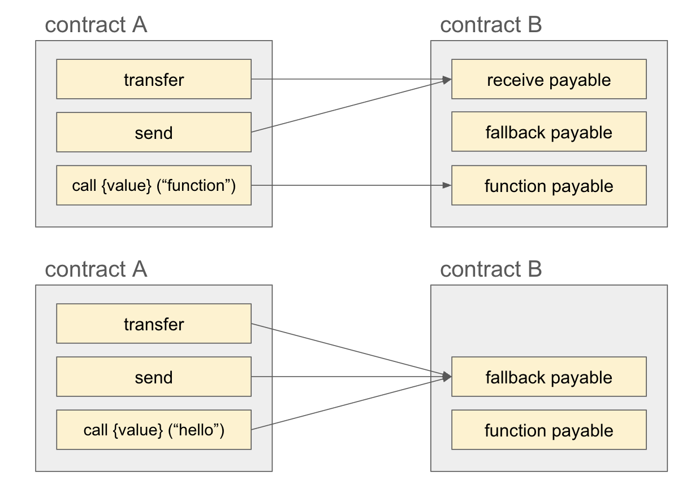

Solidity에서 **Payable**은 스마트 컨트랙트가 **이더(ETH)를 송금하거나 수신**할 수 있도록 하는 중요한 기능이다. Payable은 **특정 함수**나 **주소**가 이더를 수신할 수 있도록 명시적으로 선언되어야한다. 

## Payable 핵심 개념

### 1.1 일반적인 `address` 와 **Payable** `address`

**일반적인 `address`** : 단순히 이더리움 주소를 저장하는 데이터 타입이다. 이더를 받는 기능이 없다.

**Payable `address`** : 이더를 받을 수 있는 주소이다. payable로 선언된 주소만 이더를 수신할 수 있다. 

```solidity
address normalAddress = 0x123...; // 일반 주소
address payable payableAddress = payable(0x123...); // Payable 주소
```

- `normalAddress`에는 이더를 보낼 수 없다.
- `payableAddress`는 이더를 받을 수 있으며, 이를 통해 송금 기능을 수행할 수 있다.

### 1.2 Payable 함수

payable 키워드로 선언된 함수는 그 함수가 속해있는 스마트 컨트랙트가 이더를 받을 수 있게 한다. 즉, 해당 함수가 속해있는 스마트 컨트랙트 주소로 이더가 들어가게 된다. 

→ 한 스마트 컨트랙트에 여러 개의 payable 함수가 있어도, 결국 그 함수들이 받은 이더는 한 주소(해당 컨트랙트 주소)로 모이게 됨.

이더를 전송할 때, **트랜잭션의 `value` 필드**에 설정한 금액만큼 payable 함수로 전달할 수 있다. 스마트 컨트랙트 입장에서는 `msg.value` 로 접근할 수 있다. 

```solidity
pragma solidity ^0.8.24;

contract PayableExample {
    // Payable 함수
    function receiveEther() external payable {
        // msg.value를 통해 받은 이더 확인 가능
    }
}
```

외부에서 이 컨트랙트의 `receiveEther()` 함수를 호출하면서 트랜잭션 `value` 필드에 설정한 값만큼, `PayableExample` 컨트랙트 주소에 이더가 전송된다. 

`receiveEther` 함수 내에선 `msg.value` 를 통해 트랜잭션으로 받은 이더의 금액에 접근할 수 있다. 

---

## 이더를 보낼 때 사용하는 명령어

Solidity에서 이더를 전송할 때는 **`call` `transfer` `send`** 를 사용할 수 있다. 

### 2.1  `transfer`

간단한 이더 전송 방법으로, 내부적으로 **최대 2300 gas만 사용할 수 있도록 제한**되어있다. 이는 이더를 받을 주소에서 실행될 수 있는 작업을 최소화 하기 위해 설정된 것이다. 

**실패하면 자동으로 예외**를 발생시키므로 별도의 에러처리가 필요하지 않다.

가스 사용량이 제한함으로써 이더를 받는 주소가 악의적인 코드(ex. reentrancy attack)를 실행할 가능성을 낮춰주므로 **보안성**이 높다. 

가스 제한이 있기 때문에, 이더를 받는 주소에서 복잡한 작업을 수행해야 하는 경우에는 적합하지 않다. (**유연성이 낮다**)

```solidity
payableAddress.transfer(1 ether);
```

- 코드분석
    
    `payableAddress` 에 1 ETH를 보낸다. 단위는 `ether` `wei` `gwei` 등의 키워드를 제공한다. 
    

### 2.2  `send`

이더를 전송하는 또 다른 방법으로, 이 또한 최대 2300 gas까지 사용하게끔 제한되어 있다. 

실패 시 false를 반환하며, 예외 처리는 이 반환값을 이용하여 알아서 해야한다. 따라서 트랜잭션의 성공 여부를 직접 확인해야한다는 번거로움이 있음.  

```solidity
bool success = payableAddress.send(1 ether);
require(success, "Ether transfer failed");
```

- 코드 분석
    
    `payableAddress` 에 1 ETH를 보내고 성공 여부(bool type)를 `success` 변수에 담아 에러처리 중임
    

### 2.3  `call`

외부 컨트랙트의 특정 함수를 호출하는 저수준 호출 방식으로, 이더를 함께 보낼 수 있다. 

가장 유연한 이더 전송 방법으로, **gas 제한을 설정하지 않을 수 있**다. 

실패 시 false를 반환하며, 예외 처리는 이 반환값을 이용하여 알아서 해야한다. 

gas 제한이 없어 **유연성이 가장 높고**, 조건별 에러처리에도 유리하다. 그러나 그만큼 보안성에 신경을 써서 개발해야하는 부담이 있다. 


```solidity
(bool success, ) = payableAddress.call{value: 1 ether}("");
require(success, "Ether transfer failed");
```

- 코드 분석
    
    payableAddress: 호출할 주소
    
    `.call` 은 Solidity에서 로우 레벨 함수 호출을 수행하는 방법이다. 
    
    `{value: 1 ether}` 1ETH를 전송하기 위해 트랜잭션의 value 필드에 1 ether를 넣음. 
    
    `(””)` 호출하려는 함수와 그 함수에 전달할 인자에 대한 정보   
    현재는 비어있음 (== 단순히 컨트랙트에 이더를 전송하는 데에 사용된 케이스)
    
    > **call return 값**
    > - .call 함수의 반환값은 (bool, bytes memory) 형태의 튜플이다.   
    > - 첫번째 bool 값은 **호출이 성공했는지**에 대한 여부. 
    > - 두번째는 **호출된 함수나 트랜잭션에서 반환된 데이터**를 memory에 byte 형태로 제공한다.   
    (→ abi.decode() 를 통해 디코딩하여 사용할 수 있다. )
    
    위의 예시에서는 call의 성공여부를 success라는 변수에 담고, 반환될 데이터는 따로 처리를 안한 것이다. 
    

---

## 이더를 받을 때 사용하는 명령어

컨트랙트가 이더를 받을 땐 무조건 **함수를 통해** 받아야한다.   
스마트 컨트랙트는 일반 계정(EOA)처럼 단순히 이더를 보관할 수 있는 구조가 아니기 때문에, 이더를 받을 때 **특정 함수**를 통해 처리하게 된다. 
따라서 반드시 **컨트랙트 내의 정의되어있는 payable 함수**의 호출을 통해서 이더를 수신할 수 있다. 

그러나 이상하지 않은가? 
`call`로 `payable 함수`를 호출한다면, 그 호출하려는 `payable 함수`에 대한 시그니처와 데이터를 포함시켜야하는데, 위의 예시에서는 단순히 컨트랙트 주소(payableAddress)에 전송하려는 eth의 양만 명시했다. 
`send` 와 `transfer`도 마찬가지이다. 위의 예시에서 `payableAddress`가 EOA가 아닌 CA였다면, 그 컨트랙트는 도대체 어떤 함수가 호출되면서 이더를 받을 수 있다는 것일까? 

Solidity는 이더를 받을 때 발생하는 상황을 처리하기 위해 특별히 **`receive` 함수**와 **`fallback` 함수**를 컨트랙트에 정의할 수 있도록 설계되었다.  
정확히 말하면, 컨트랙트에 이더를 보내올 때, `call`을 통해 사용자 임의의 payable 함수를 특정 지어서 호출하는 게 아닌 이상, `receive` 또는 `fallback` 이라는 이름의 함수가 자동으로 실행되게끔 설계되었다는 뜻이다.  
특히 호출할 함수를 임의로 설정할 수 **없는** `send`, `transfer`를 통해 이더를 수신하기 위해서는, **수신 컨트랙트 내부에 반드시 `receive` `fallback` 이라는 이름의 함수가 실행되도록 정의해둬야 한다.** 

### 3.1 `receive` 함수
- `send` `transfer` 로 보내오는 이더를 받을 때 실행되는 함수
- 트랜잭션에서 **데이터가 포함되지 않은 경우**에도 호출된다.
- 반드시 **Payable**로 선언되어야 한다.

```solidity
pragma solidity ^0.8.24;

contract ReceiveExample {
    // Receive 함수
    receive() external payable {
        // 이더를 받을 때 실행
    }
}

```

### 3.2 `fallback` 함수

- `fallback` 함수는 기본적으로 호출하려는 함수가 컨트랙트에 정의되어 있지 않을 때 실행되는 **대체 처리 함수**이다. 

**fallback 함수는 호출하려는 함수가 컨트랙트에 없을 때 실행되는것으로 일맥상통한다.** 

1. evm은 call 트랜잭션에 포함된 **데이터**(함수 시그니처와 파라미터)를 해석하려고 시도하며, 컨트랙트 주소 내에 매칭되는 함수가 없으면 **`fallback` 함수**가 실행된다.
2. call 호출 시 데이터에 함수 시그니처가 아닌 임의의 데이터를 넣어서 호출할 수도 있다. 이 경우 또한 evm은 그 데이터를 함수 시그니처로 간주하고 실행하지만 컨트랙트 내에 매칭되는 함수가 없으므로 **`fallback`** 함수를 호출하게 된다.
3. `컨트랙트주소.함수이름` 으로 직접 호출 할 때에도 해당 함수가 없을 때, 차안으로 fallback 함수가 호출된다.
4. **`receive`** 함수가 호출되어야하는데, 컨트랙트 내에 제대로 정의되어있지 않다면 역시나 **`fallback` 함수**가 실행된다.
- 꼭 이더를 받을 때만 호출되는 것은 아니긴 하지만, 이더를 받게 하려면 반드시 **Payable**로 선언해야 한다.

```solidity
pragma solidity ^0.8.24;

contract FallbackExample {
    // Fallback 함수
    fallback() external payable {
        // 이더를 받을 때 실행
    }
}
```

---

---

## 정리

### 이더 전송

`transfer` `send`  
-> 우선적으로 receive 함수 호출  
없다면 fallback 호출  
이도 없다면 트랜잭션 실패 (error or false)

`call`  
-> 데이터가 있다면 함수 시그니처로 간주하고 특정 함수 실행.   
매치되는 함수 없다면 fallback 호출  
-> 데이터가 없다면 receive or fallback 호출

### 이더 수신

`EOA` : 어떤 방법으로든 그냥 받으면 됨

`CA` : 반드시 payable 함수로 받아야한다.   
transfer, send로 받기 위해서는 꼭 `payable receive` 나  `payable fallback` 함수가 컨트랙트 내에 정의되어 있어야함.   
또는 `payable 함수`를 정의해놓고 그 함수의 호출로서 이더를 받을 수도 있다.


---

위와 값이 contract B가 구현해놓은 함수에 따라 contract A에서 호출하게 되는 함수도 달라진다.  
`transfer`과 `send`의 경우 receive 함수가 구현되어있지 않다면 fallback 함수가 호출된다.  
`call`은 데이터를 비우면, receive나 fallback이 호출되지만, 데이터가 있다면, 특정 함수나 fallback이 호출된다.  

