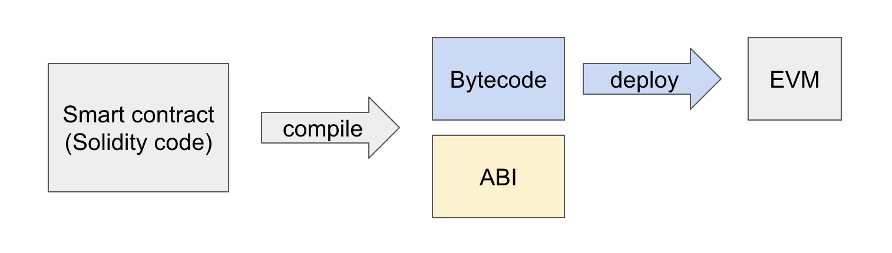

# `Solidity Overview`

## Solidity란 무엇인가?
 Solidity는 이더리움 네트워크에서 실행되는 스마트 컨트랙트를 개발하기 위한 고수준 언어이다. 블록체인의 특성과 스마트 컨트랙트의 동작을 이해하기 위해 필수적으로 배워야 하는 기술이다. 

---

## 스마트 컨트랙트란?
스마트 컨트랙트는 블록체인 위에서 실행되는 코드로, 특정 조건이 충족되면 자동으로 동작한다. 일반적인 계약과 달리, 스마트 컨트랙트는 중앙화된 중개자 없이 블록체인 네트워크 내에서 신뢰할 수 있는 방식으로 실행됩니다.

스마트 컨트랙트는 단순히 블록체인 상에서 실행되는 프로그램이라고 생각하면 쉽다. 스마트 컨트랙트는 데이터와 코드가 특정 주소에 저장된 블록체인 객체이다. 즉, 이더리움 네트워크 내에서 특정 주소에 고유하게 존재하며, 이 주소로 접근하여 그 안에 정의된 코드를 실행할 수 있는 것이다.

## 계정
이더리움에는 두 가지 계정이 있다. 
1. **외부계정(EOA, Externally Owned Account)** : 개인 키로 제어되는 계정(사람이 제어)  
EOA가 스마트 컨트랙트에 정의된 함수들을 실행하는 트랜잭션을 제출하며, 이는 스마트 컨트랙트가 실행되는 트리거 역할을 한다. 

2. **스마트 컨트랙트 계정(CA, Contract Account)** : 코드로 제어되는 계정
특정 주소를 통해 접근할 수 있고, 호출되면 정의된 코드를 실행한다.  
트랜잭션을 직접 생성할 수 없으며, 다른 계정(EOA 또는 CA)이 호출해야만 실행된다. 
블록체인 상에서 실행 가능한 **독립적인 프로그램**으로 작동한다. 

>**계정 주소**  
>* 외부 계정의 주소는 개인 키에서 유도되어 생성된다. 
>* 스마트 컨트랙트 계정의 주소는 컨트랙트 생성 시 결정된다.

여기서 중요한 점은 스마트 컨트랙트가 **이더리움 계정**이라는 것이다. EOA와 CA는 모두 이더리움 네트워크(EVM)에서 동일하게 취급된다. 각 계정은 Ether 잔액을 보유할 수 있으며, 트랜잭션으로 잔액을 수정할 수 있다. 

## 트랜잭션
트랜잭션은 한 계정에서 다른 계정으로 보내는 메시지로 EOA에서 암호화 서명된 명령이다.  
블록체인은 글로벌 공유 트랜잭션 데이터베이스이다. 누구나 네트워크에 참여하여 데이터베이스의 항목을 읽을 수 있다. 그리고 데이터를 변경할 땐, 트랜잭션을 생성해야하며, 네트워크의 참여자들이 이를 승인(합의)해야한다. 

* 트랜잭션은 **원자성**을 보장한다. 시행하려는 작업이 전부 실행되거나 전부 롤백되어야한다. 
* 트랜잭션이 진행되는 동안 다른 트랜잭션은 이를 변경할 수 없다. 

## EVM
 EVM은 이더리움 스마트 컨트랙트를 실행하는 런타임 환경이다. 스택 기반 가상 머신으로 설계되어 있으며, 스마트 컨트랙트가 컴파일된 bytecode를 읽고 이를 실행한다.   

 쉽게 말해, 이더리움 스마트 컨트랙트가 "작동"하는 특별한 컴퓨터라고 생각하면 된다. 예를 들어, 스마트폰에서 앱을 실행하려면, 그 앱이 작동하기 위해 모바일 운영체제 (Android, iOS)가 필요한 것처럼, 스마트 컨트랙트가 실행되려면, EVM이라는 공간이 필요하다. 

 EVM은 이더리움 네트워크의 모든 노드에서 작동하며, 스마트 컨트랙트가 실행되는 동안 필요한 데이터, 코드, 규칙 등을 제공한다. 이 공간은 독립적이고 안전한 환경이라서 외부의 영향을 받지 않고, 오직 스마트 컨트랙트의 로직대로만 작동한다. 
 

* **스마트 컨트랙트 작성** (Solidity Code)
컴퓨터공학적으로 보면, Solidity는 사람이 읽기 쉬운 소스 코드를 제공하며, 이는 이후 컴파일 과정을 통해 기계가 이해할 수 있는 형태로 변환된다. 
* **컴파일 단계** (Bytecode와 ABI 생성)   
    Solidity로 작성된 스마트 컨트랙트는 컴파일러를 통해 **Bytecode**와 **ABI**를 생성한다.   
    * **Bytecode**  
    컴파일된 스마트 컨트랙트의 저수준 기계 코드로, EVM이 이해하고 실행할 수 있는 형태로 변환된 코드이다. 블록체인에 배포된 스마트 컨트랙트는 이 Bytecode 형태로 저장된다.   
    * **ABI(Application Binary Interface)**  
    ABI는 스마트 컨트랙트의 함수 호출 규칙, 데이터 타입, 함수 시그니처 등을 정의하여 외부 애플리케이션과의 인터페이스를 제공한다. JSON 형식이다. 
* **배포**   
컴파일된 Bytecode는  이더리움 블록체인에 배포되어 특정 주소에 저장된다. 배포된 스마트 컨트랙트는 이후 EVM에서 실행될 준비가 완료된 상태가 된다. 

Solidity와 스마트 컨트랙트는 블록체인 기술의 핵심이며, 탈중앙화 애플리케이션(dApp)을 설계하고 구현하는 데 필수적인 도구이다. 이더리움 네트워크와 EVM은 이러한 스마트 컨트랙트를 실행할 수 있는 안정적이고 신뢰할 수 있는 환경을 제공한다.