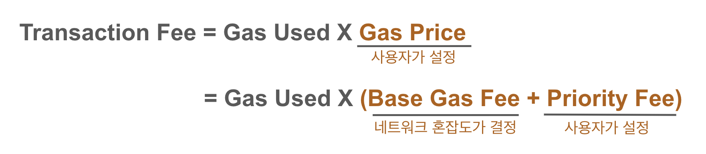
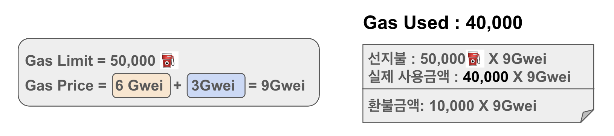
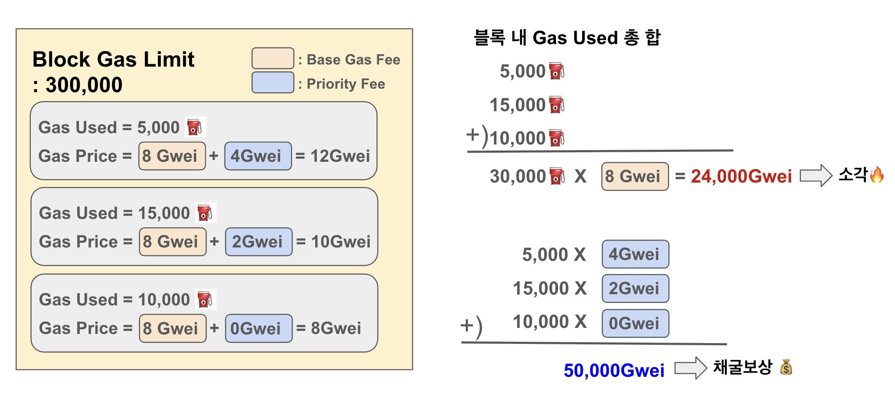
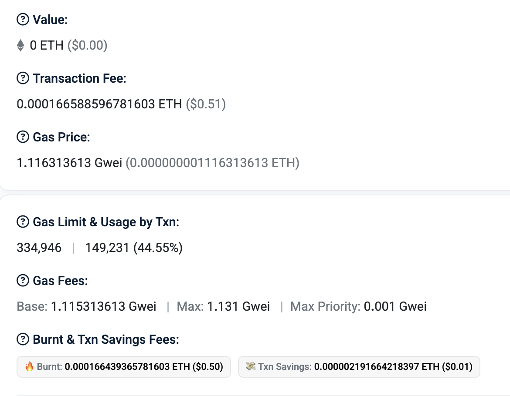

# Gas
Gas는 이더리움 네트워크에서 **트랜잭션을 실행하기 위해 필요한 비용**을 나타낸다. 트랜잭션이 생성될 때, 트랜잭션 발신자는 특정 양의 Gas를 지불해야 한다. 트랜잭션이 실행되는 동안, EVM은 정해진 규칙에 따라 Gas를 점진적으로 소모한다. 만약 Gas가 부족해지거나 음수가 되는 경우, **Out-of-Gas 예외**가 발생하며 트랜잭션 실행이 중단되고 현재 호출 프레임에서 이루어진 **모든 상태 변경은 되돌려진다.**

## Gas 메커니즘의 목적
Gas는 이더리움 네트워크에서 트랜잭션이나 스마트 계약 실행 시 소요되는 컴퓨팅 리소스(CPU, 메모리, 디스크 I/O 등) 소비에 대한 비용을 지불하는 역할을 한다. 
이 메커니즘은 첫째, EVM 실행 시간을 효율적으로 사용하도록 유도하는 데에 목적이 있다. 두번째로 EVM 실행자(채굴자/스테이커)에게 작업에 대한 보상을 지급하기 위함이다. 마지막으로, 각 블록에는 처리 가능한 Gas의 최대치가 설정되어 있어, 블록 검증에 필요한 작업량을 제한한다. 

## 트랜잭션에서의 가스비

### 계산식:  
  
* `Gas Used` : 트랜잭션 실행 시 실제로 사용된 가스량(단위 X)  
* `Gas Price` : **가스 단위당 지불할 금액(단위: Gwei)**
    * `Base Gas Fee` : 네트워크 혼잡도에 따라 자동 결정
    * `Priority Fee` : 사용자가 설정하는 검증자에게 지불할 추가 팁

 `Gas Limit` : 발신자가 트랜잭션을 생성할 때 설정한 최대 가스 허용량 
 * 사용자는 Gas Limit에 해당하는 금액(Gas Limit * Gas Price)을 선결제
 * 트랜잭션 실행 후, 실제 사용된 비용(Transaction Fee)을 제외한 나머지 금액을 환불받음.
 * 트랜잭션이 (가스비 부족이 아닌 다른 이유에 의해)실패해도, 그 시점까지 소비하고 남은 가스비는 돌려받는다. 

**<예시>**

 조건  
`Gas Limit`: 발신자는 **50,000** 만큼 가스를 소비할 의향이 있다.   
`Gas Used`: 실제 트랜잭션은 **40,000**만큼의 가스를 소비했다.  
`Gas Price`: 발신자는 단위가스당 **9(Gwei)** 씩 지불하려고 한다.   
-> `Base Gas Fee`: **6(Gwei)** (네트워크 결정)   
-> `Priority Fee`: **3(Gwei)** (사용자 결정) 

---
>계산  
사전 지불된 금액 : **50,000 X 9(Gwei)**    
사용된 가스량 : **40,000**  
실제 지불 금액 : **40,000 X 9(Gwei)**  
환불 받는 금액 : **(50,000 - 40,000) X 9(Gwei)**

가스비는 네트워크를 사용하는 비용으로, 트랜잭션 실행에 필요한 가스량과 가스 가격에 따라 결정.  
Gas Limit은 사용자가 설정하며, 트랜잭션 실패 시 남은 가스는 환불.  
정확한 가스비 계산으로 비용을 절약하고 트랜잭션 실패를 방지해야한다.

 ---
## 블록에서의 가스비
이더리움 블록은 여러 트랜잭션을 포함하며, 각 트랜잭션은 가스를 소비한다. 

### `Block Gas Limit`
**한 블록에 포함될 수 있는 가스의 최대 총량**을 의미한다.
* 블록 내 모든 트랜잭션의 **Gas Used** 합이 **Block Gas Limit**을 초과할 수 없다.
* 네트워크 검증자(채굴자/노드)가 블록을 생성할 때 이 값을 기준으로 트랜잭션을 선택하게 된다. 

Block Gas Limit은 네트워크 상태에 따라 유동적으로 변하면서 블록크기를 제한해 트랜잭션 처리 속도와 네트워크 혼잡도를 조절하여 안정성을 유지하는 역할을 한다. 

**<예시>**

조건  
`Block Gas Limit`: 한 블록에는 최대 300,000가스를 소비할만큼의 트랜잭션을 포함시킬 수 있다. (예시를 위한 수치임)  
블록 내 트랜잭션 3개
1. Gas Used = 5,000, Gas Price = 12 Gwei
2. Gas Used = 15,000, Gas Price = 10 Gwei
3. Gas Used = 10,000, Gas Price = 8 Gwei

블록 전체 소비된 가스 총합 : 5,000 + 15,000 + 10,000 = **30,000** ⛽️  

### 블록 가스비와 채굴자의 수익
각 트랜잭션별로 **소비된 가스량**과 **Gas Price**들이 곱해져서 transaction fee의 총합이 나올텐데, 
`Gas Price`의 `Base Gas Fee`로 인한 비용은 소각된다.
`Gas Price`의 `Priority Fee`로 인한 비용은 채굴자의 수익이 된다. 

따라서 Block Gas Limit을 지키면서 트랜잭션을 포함시켜야 하는 채굴자는 트랜잭션 발신자가 설정한 `Priority Fee`가 높은 트랜잭션들을 먼저 포함시키게 된다. 

## Ether Units
* **Wei** : Ethereum에서 가장 작은 단위로, 1 Ether = 10^18 Wei이다.
* **GWei** : 1 Gwei = 10^9 Wei
* **Ether** : 기본 단위로, 1 Ether = 10^18 Wei이다.

Remix는 기본적으로 Wei 단위를 사용한다.

---
실제 etherscan 예시

