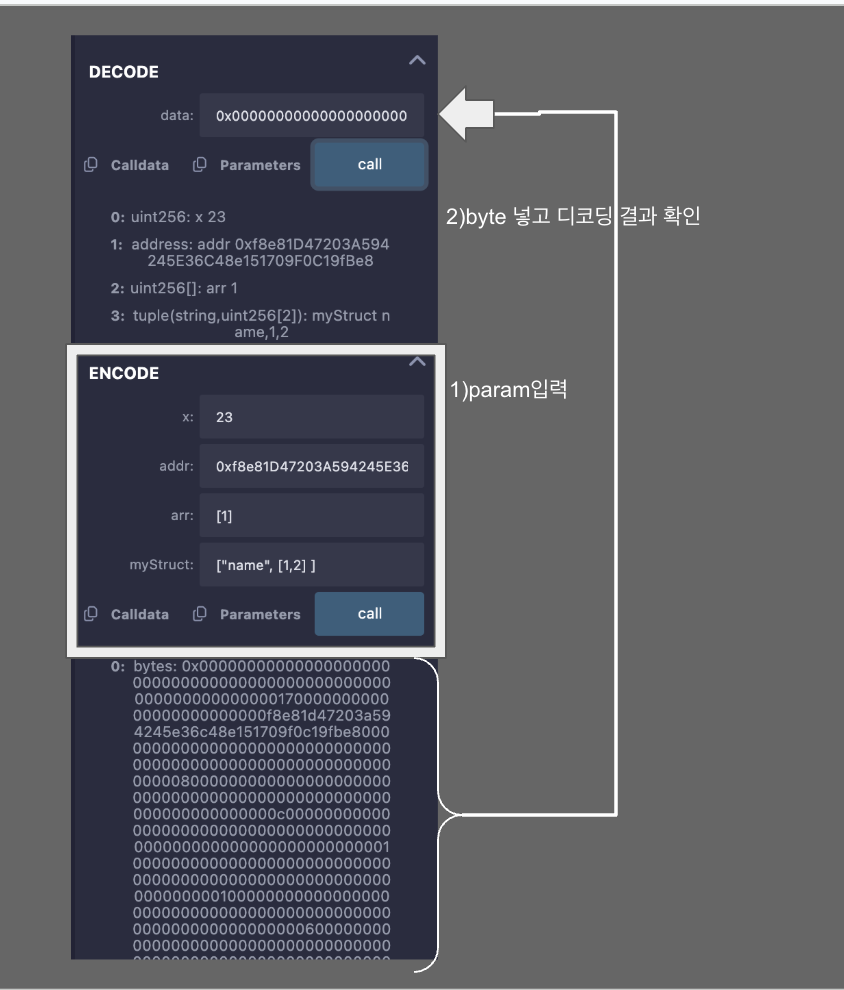

## ABI (Application Binary Interface)

ABI는 스마트 컨트랙트와 외부 애플리케이션(또는 다른 스마트 컨트랙트) 간의 **상호작용을 위한 표준화된 인터페이스**이다. 

스마트 컨트랙트는 고수준 언어(예: Solidity)로 작성되지만, EVM(Ethereum Virtual Machine)은 **바이너리 코드만** 처리할 수 있다. ABI는 고수준 언어로 작성된 함수 호출을 바이너리 형식으로 인코딩 하고, 이를 통해 EVM이 이해할 수 있게 한다. 
반대로, EVM에서 반환된 데이터를 고수준 언어로 디코딩하여 사람이 이해할 수 있는 형태로 변환하기도 한다. 

### 주요역할

1. 데이터 인코딩 : 함수 호출 시 필요한 매개변수 데이터를 바이너리 형식으로 변환
2. 데이터 디코딩 : 함수 호출 결과를 고수준 언어의 데이터 형태로 변환.
3. 함수 식별자 생성 : 호출하려는 함수의 고유 식별자를 생성하여 올바른 함수 호출을 보장.

### ABI 구조

Function Selector : 함수 이름과 매개변수 타입을 해싱하여 생성된 첫 4바이트(고유 식별자). 인터페이스에 정의된 함수의 선택기는 .selector 속성을 사용하여 쉽게 얻을 수 있다. 

Encoded Arguments : 함수 호출에 필요한 매개변수 데이터를 바이너리 형식으로 변환한 값


### 인코딩 예제 코드
```solidity
// SPDX-License-Identifier: MIT
pragma solidity ^0.8.24;

interface IERC20 {
    function transfer(address, uint) external;
}

contract Token {
    function transfer(address, uint) external {}
}

// AbiEncode Contract
contract AbiEncode {
    function test(address _contract, bytes calldata data) external {
        (bool ok, ) = _contract.call(data);
        require(ok, "call failed");
    }

    function encodeWithSignature(
        address to,
        uint amount
    ) external pure returns (bytes memory) {
        return abi.encodeWithSignature("transfer(address,uint256)", to, amount);
    }

    function encodeWithSelector(
        address to,
        uint amount
    ) external pure returns (bytes memory) {
        return abi.encodeWithSelector(IERC20.transfer.selector, to, amount);
    }

    function encodeCall(address to, uint amount) external pure returns (bytes memory) {
        return abi.encodeCall(IERC20.transfer, (to, amount));
    }
}
```

### test() 함수
```solidity
function test(address _contract, bytes calldata data) external {
    (bool ok, ) = _contract.call(data);
    require(ok, "call failed");
}
```
`_contract` : 호출할 스마트 계약 주소  
`call` : 저수준 호출  
`data` : **ABI로 인코딩된** 함수 호출 데이터 

### encodeWithSignature() 함수
```solidity
function encodeWithSignature(
    address to,
    uint amount
) external pure returns (bytes memory) {
    return abi.encodeWithSignature("transfer(address,uint256)", to, amount);
}
```
`"transfer(address,uint256)"` : 호출하려는 함수의 이름과 매개변수 타입을 문자열로 지정  
`to` : transfer 함수의 첫 번째 매개변수 (받는 사람 주소)  
`amount` : transfer 함수의 두 번째 매개변수 (전송 금액)   
`abi.encodeWithSignature` : 함수 이름과 매개변수를 인코딩하여 바이너리 형식으로 반환
-> 특정 함수 이름과 매개변수를 직접 지정하여 ABI 데이터를 생성한 것 

### encodeWithSelector 함수
```solidity
function encodeWithSelector(
    address to,
    uint amount
) external pure returns (bytes memory) {
    return abi.encodeWithSelector(IERC20.transfer.selector, to, amount);
}
```
`IERC20.transfer.selector` : transfer 함수의 고유 식별자 (4바이트 함수 selector)  
`to` : transfer 함수의 첫 번째 매개변수 (받는 사람 주소)  
`amount` : transfer 함수의 두 번째 매개변수 (전송 금액)  
`abi.encodeWithSelector` : 함수 selector와 매개변수를 인코딩하여 바이너리 형식으로 반환  
->인터페이스를 사용하여 함수 selector를 생성하고 매개변수를 추가하여 ABI 데이터를 생성한 것. 

### encodeCall 함수
```solidity
function encodeCall(address to, uint amount) external pure returns (bytes memory) {
    return abi.encodeCall(IERC20.transfer, (to, amount));
}
```
`IERC20.transfer`: 호출하려는 함수의 인터페이스  
`(to, amount)` : 함수에 전달할 매개변수  
`abi.encodeCall` : 함수와 매개변수를 인코딩하여 바이너리 형식으로 반환
-> 함수와 매개변수를 함께 지정하여 더 간결하게 ABI 데이터를 생성

---
### 정리
`call` - 낮은 수준의 함수 호출, ABI 데이터를 직접 전달  
`encodeWithSignature` - 함수 이름과 매개변수를 명시적으로 지정하여 호출 데이터를 생성  
`encodeWithSelector` - 함수 selector를 사용하여 호출 데이터를 생성  
`encodeCall` - 함수와 매개변수를 함께 지정하여 간결하게 인코딩

---

### 디코딩 예제 코드
```solidity
// SPDX-License-Identifier: MIT
pragma solidity ^0.8.24;

// AbiDecode Contract
contract AbiDecode {
    struct MyStruct {
        string name;
        uint[2] nums;
    }

    function encode(
        uint x,
        address addr,
        uint[] calldata arr,
        MyStruct calldata myStruct
    ) external pure returns (bytes memory) {
        return abi.encode(x, addr, arr, myStruct);
    }

    function decode(
        bytes calldata data
    )
        external
        pure
        returns (uint x, address addr, uint[] memory arr, MyStruct memory myStruct)
    {
        (x, addr, arr, myStruct) = abi.decode(data, (uint, address, uint[], MyStruct));
    }
}
```
### encode 함수
```solidity
function encode(
    uint x,
    address addr,
    uint[] calldata arr,
    MyStruct calldata myStruct
) external pure returns (bytes memory) {
    return abi.encode(x, addr, arr, myStruct);
}
```
`x` `addr` `arr` `myStruct` 다양한 데이터 타입을 받아와 `abi.encode`를 사용하여 인코딩된 바이트 배열 (bytes memory)을 반환

### decode 함수
```solidity
function decode(
    bytes calldata data
)
    external
    pure
    returns (uint x, address addr, uint[] memory arr, MyStruct memory myStruct)
{
    (x, addr, arr, myStruct) = abi.decode(data, (uint, address, uint[], MyStruct));
}
```
`bytes calldata data` 매개변수를 받아 `abi.decode`를 사용하여 data 바이트 배열을 원래의 구성 요소들로 디코딩함.
abi.decode의 두 번째 인수는 data가 해독되어야 할 유형을 지정한다. 인코딩 할 때 사용된 타입과 일치해야 한다. 

---

