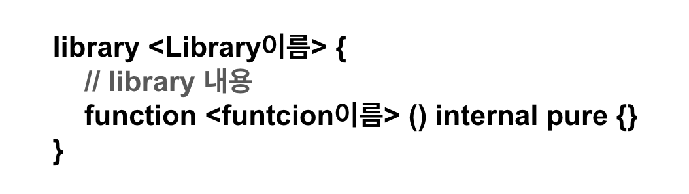

# Import
Solidity에서 import 키워드는 코드를 재사용하고 모듈화하여 프로젝트를 더 효율적으로 관리할 수 있도록 돕는다. 이를 통해 다른 파일에서 정의된 구조체, 함수, 계약 등을 불러와 사용할 수 있으며, 로컬 파일과 외부 파일 모두를 지원한다.

## 로컬 파일 임포트
 동일한 프로젝트 폴더 내에서 파일을 불러오는 방식
 ```bash
 ├── Import.sol
└── Foo.sol
```

### Foo.sol
```solidity
// SPDX-License-Identifier: MIT
pragma solidity ^0.8.24;

struct Point {
    uint256 x;
    uint256 y;
}

error Unauthorized(address caller);

function add(uint256 x, uint256 y) pure returns (uint256) {
    return x + y;
}

contract Foo {
    string public name = "Foo";
}
```
### Import.sol
```solidity
// SPDX-License-Identifier: MIT
pragma solidity ^0.8.24;

// Foo.sol 파일 전체를 임포트
import "./Foo.sol";

// 특정 심볼만 임포트하며 별칭(alias)을 사용
import {Unauthorized, add as func, Point} from "./Foo.sol";

contract Import {
    Foo public foo = new Foo();

    function getFooName() public view returns (string memory) {
        return foo.name();
    }
}
```
`import "./Foo.sol";` : Foo.sol 파일 전체를 현재 파일로 불러옴   
`import {Unauthorized, add as func, Point} from "./Foo.sol";` : Foo.sol에서 특정 심볼만 임포트하며, add 함수는 func라는 별칭으로 사용


## 외부파일 임포트
GitHub와 같은 원격 저장소에서 파일을 직접 임포트할 수도 있다. 이는 공용 라이브러리나 계약을 재사용할 때 유용하다. 

```solidity
// 임포트: GitHub 저장소의 특정 파일
import "https://github.com/owner/repo/blob/branch/path/to/Contract.sol";

// OpenZeppelin 라이브러리 임포트 예시
import "https://github.com/OpenZeppelin/openzeppelin-contracts/blob/release-v4.5/contracts/utils/cryptography/ECDSA.sol";
```
---
# Library
Library는 반복적으로 사용되는 기능을 모듈화하여 재사용 가능하게 만드는 코드 구조이다.  이를 통해 코드의 재사용성을 높이고, 이미 구축된 코드를 활용하여 가스 비용을 절약할 수 있다. 

### Library 특징
* **State Variable 없음** : Library는 상태 변수(state variable)를 선언할 수 없다.
* **Ether 전송 불가** : Library는 Ether를 전송할 수 없다.
* **함수 호출 제한** : Library 함수는 pure 또는 view로 표시된 경우에만 직접 호출할 수 있다.

### Library 종류
`Embedded Library`  
Library가 internal 함수만 포함하면, EVM이 해당 Library를 별도로 배포하지 않고 스마트 계약에 직접 포함시킨다. 

`Linked Library`  
Library에 public 또는 external 함수가 포함된 경우, Library를 별도로 배포하고, 다른 컨트랙트에서 해당 Library를 참조해야한다. 

### Library 구조


* Library는 library 키워드를 사용하여 선언한다.
* Library 내부에는 `internal`, `public`, `external`함수가 포함될 수 있다.

### Library 사용
library를 사용하는 방법에는 두가지가 있다.
1. **직접호출** : Library의 함수를 일반적인 함수 호출 방식으로 직접 호출
2. **using for** : 특정 데이터 타입에 대해 Library 함수를 인스턴스 메서드처럼 사용 

```bash
├─ MathLibrary.sol
└─ MyContract.sol
```
```solidity
import "./MathLibrary.sol";


contract MyContract{
    // 직접 호출 사용
    function subtractNumbers(uint256 a, uint256 b) public pure returns (uint256){
        return Mathlibrary.subtract(a,b)
    }

    //using for 사용
    using MathLibrary for uint256;
    function addNumbers(uint256 a, uint256 b) public pure returns (uint256){
        return a.add(b);
    }
}
```
`using MathLibrary for uint256`
`MathLibrary`에 정의된 함수들을 `uint256` 타입에서 직접 호출할 수 있도록 연결한다는 의미. 
연결된 Library의 함수는 uint256 타입에 대해 인스턴스 메서드처럼 호출할 수 있게 된다. 
-> 특정 데이터 타입(uint256)을 확장하여 Library의 함수들을 마치 uint256 타입의 메서드처럼 사용할 수 있게 하는 것.

---

### Library 예제코드
```solidity
// SPDX-License-Identifier: MIT
pragma solidity ^0.8.24;

library Math {
    function sqrt(uint256 y) internal pure returns (uint256 z) {
        if (y > 3) {
            z = y;
            uint256 x = y / 2 + 1;
            while (x < z) {
                z = x;
                x = (y / x + x) / 2;
            }
        } else if (y != 0) {
            z = 1;
        }
        // else z = 0 (default value)
    }
}

contract TestMath {
    function testSquareRoot(uint256 x) public pure returns (uint256) {
        return Math.sqrt(x);
    }
}

// index로 element를 제거하고 array를 재구성 하는 Array function
// elemnet 사이에 간격이 없도록 한다.
library Array {
    function remove(uint256[] storage arr, uint256 index) public {
        // 마지막 요소를 삭제할 위치로 이동
        require(arr.length > 0, "Can't remove from empty array");
        arr[index] = arr[arr.length - 1];
        arr.pop();
    }
}

contract TestArray {
    using Array for uint256[];

    uint256[] public arr;

    function testArrayRemove() public {
        for (uint256 i = 0; i < 3; i++) {
            arr.push(i);
        }

        arr.remove(1);

        assert(arr.length == 2);
        assert(arr[0] == 0);
        assert(arr[1] == 2);
    }
}
```

**`Math` library** : 숫자의 제곱근을 계산하는 `sqrt ` 함수를 포함하고 있다.    
**`TestMath` contract** : 직접 호출 방식 사용  
**`Array` library** : array에서 특정 index의 element를 제거하고, array의 gap을 채우기 위한 `remove` 함수 포함   
**`TestArray` contract** : using for (타입 확장) 사용

