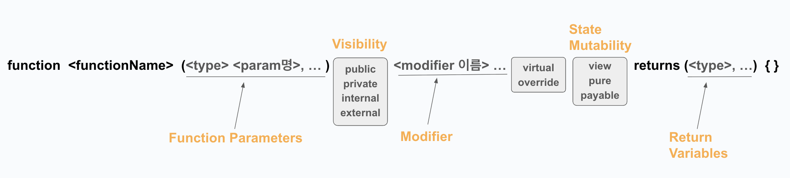

# Solidity 함수 구조

---


## 1. `functionName`

- **함수의 이름을 정의** (필수)
- 함수의 이름은 고유해야 한다. (같은 이름의 함수가 중복될 수 없다.)
- 단, **함수 오버로딩(Overloading)** 을 통해 매개변수 타입이 다르면 같은 이름을 사용할 수 있다.

---

## 2. `Function Parameters`

- **함수가 입력으로 받을 값을 정의** (선택)
- 각 매개변수는 **타입**과 함께 정의된다. 입력 매개변수가 없을 경우에는 비워두면 된다.
- 여러 매개변수를 정의할 수 있으며, `<타입> <변수명>`의 쌍이 쉼표(`,`)로 구분되어 들어간다.

### 추가 사항:
- **참조 키워드**: `storage`, `memory`, `calldata` 키워드가 필요한 경우도 있다.
- **복잡한 데이터 타입 제한**:
  - `struct`와 `mapping` 같은 복잡한 데이터 타입은 컴파일러가 ABI를 생성할 때 제대로 처리할 수 없어, **인자나 반환값**으로 사용할 수 없다.
  - 해결 방법:
    - `struct`는 각 필드를 개별적으로 나눠서 전달해야 한다.
    - `mapping`은 키를 통해 값에 접근하는 방식을 사용해야 한다.

---

## 3. `Visibility`

- **함수의 접근 범위를 지정** (반필수)
- 명시하지 않을 경우, 기본값은 `public`.

### Visibility 키워드:
- `public`: 누구나 호출 가능
- `private`: 오직 동일 계약 내에서만 호출 가능
- `internal`: 동일 계약 또는 상속받은 계약에서만 호출 가능
- `external`: 계약 외부에서만 호출 가능 (내부에서는 `this`를 통해 호출 가능)

---

## 4. `Modifier`

- **함수 실행 전/후 특정 조건을 검사하거나 추가 작업을 수행**할 수 있는 수식어 (선택)
- 여러 개의 Modifier를 사용할 수 있으며, **띄어쓰기로 구분**한다.

---

## 5. `<virtual/override>`

- **함수가 상속 관계에서 오버라이딩될 수 있는지 여부를 정의** (선택)

### 키워드 설명:
- `virtual`: 해당 함수가 상속받은 컨트랙트에서 **오버라이드 가능**함을 명시
- `override`: 상속받은 함수의 **재정의**를 명시

---

## 6. `State Mutability`

- **함수의 상태 변경 여부 및 이더 전송 가능 여부를 정의** (선택)

### 키워드 설명:
- `view`: 상태를 **읽기 가능** (변경 불가)
- `pure`: 상태를 **읽거나 변경하지 않음**
- `payable`: **이더를 받을 수 있는 함수**

---

## 7. `return variables`

- **함수가 반환할 데이터의 타입을 정의** (선택)
- 여러 개의 반환값을 정의할 수 있으며, **쉼표(`,`)**로 구분한다.

---

### 예제 코드
**returnMany** 함수
```solidity
function returnMany() public pure returns (uint256, bool, uint256) {
    return (1, true, 2);
}
```
- `1` `true` `2` 세 값을 튜플 형태로 반환.


**named** 함수
```solidity
function named() public pure returns (uint256 x, bool b, uint256 y) {
    return (1, true, 2);
}
```
- 반환 값을 이름으로 명명하여 반환.

**assigned** 함수
```solidity
function assigned() public pure returns (uint256 x, bool b, uint256 y) {
    x = 1;
    b = true;
    y = 2;
}
```
- 반환 값을 이름에 할당한다. 이 경우 return 문을 생략할 수 있다.

**destructuringAssignments** 함수
```solidity
function destructuringAssignments()
    public
    pure
    returns (uint256, bool, uint256, uint256, uint256)
{
    (uint256 i, bool b, uint256 j) = returnMany();
    // 값을 생략할 수 있습니다.
    (uint256 x,, uint256 y) = (4, 5, 6);
    return (i, b, j, x, y);
}
```
- 다른 함수를 호출하여 반환 값을 구조 분해 할당(destructuring assignment)할 수 있다.
- 특정 값을 생략할 수도 있다.

**arrayInput** 함수
```solidity
function arrayInput(uint256[] memory _arr) public {}
```
- 배열을 입력으로 받을 수 있다.

**arrayOutput** 함수
```solidity
uint256[] public arr;

function arrayOutput() public view returns (uint256[] memory) {
    return arr;
}
```
- 배열을 출력으로 반환할 수 있다.


**someFuncWithManyInputs** 함수
```solidity
function someFuncWithManyInputs(
    uint256 x,
    uint256 y,
    uint256 z,
    address a,
    bool b,
    string memory c
) public pure returns (uint256) {}
```

```solidity
function callFunc() external pure returns (uint256) {
    return someFuncWithManyInputs(1, 2, 3, address(0), true, "c");
}
```
```solidity
function callFuncWithKeyValue() external pure returns (uint256) {
    return someFuncWithManyInputs({
        a: address(0),
        b: true,
        c: "c",
        x: 1,
        y: 2,
        z: 3
    });
}
```


- 여러 입력을 받는 함수 **someFuncWithManyInputs**
- **callFucn** 함수 -> 인자를 순서대로 전달하여 함수를 호출
- **callFuncWithKeyValue** 함수 -> 키-값 쌍을 사용하여 함수 호출

