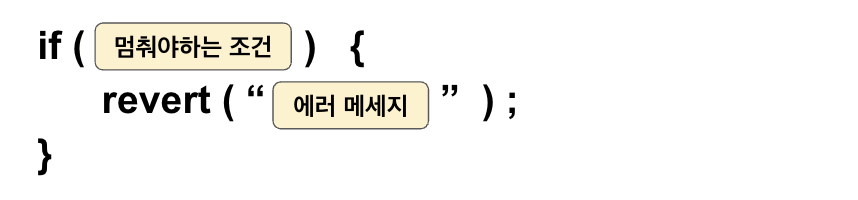
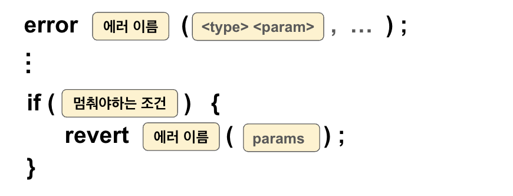

# Error

Errors는 사용자에게 작업 실패 이유를 전달하기 위한 도구이다. 
컨트랙트 내부/외부, 인터페이스, 라이브러리 등 다양한 위치에서 정의할 수 있다.

- 가스 효율적이고 명확한 실패 이유를 제공하므로, 코드의 가독성과 유지보수성을 높이는 데 유용하다. 

**주의**: Error 데이터를 기반으로 프로그램의 흐름을 제어하는 것은 위험하다. 실패 이유를 설명하고, 상태 변경을 취소하는 데만 사용해야 한다. 

### 내부 호출 시 주의사항
- 내부에서 호출한 `revert` 데이터가 외부 호출 체인을 통해 전달되기 때문에 외부 호출자의 입장에서는 이 데이터가 어디에서 발생한 에러 데이터인지 알 수 없다.
- 즉, 내부 호출에서 발생한 에러가 외부 호출에서 발생한 에러처럼 보일 수 있다.
- 공격자가 이를 악용해 프로그램의 흐름을 조작할 수 있다.

---
soilidy에서의 error 처리는 크게 세가지 주요 방법으로 나뉜다. `assert` `require` `revert`
이 세가지 에러 처리 방법과 더 나아가 `custom revert` 까지 알아보자. 

---
# assert

특정 상태가 절대적으로 참이어야 하는 경우를 확인할 때 사용.

- 시스템의 **논리적 무결성(logical integrity)** 을 보장하기 위해 설계된 것으로, 주로 개발자가 작성한 코드의 논리적 문제나 **불변 조건(invariant)** 이 깨졌을 때 사용한다. 
- 외부 입력값이 아니라, **컨트랙트 내부 로직에서 문제가 발생했을 때** 사용한다.

### 실패 시 동작
- 모든 가스를 소비하고, 상태를 롤백.
- Solidity에서 `Panic(uint256)`이라는 내장 에러를 발생시킨다. 

### 목적
- assert의 목적은 치명적 오류를 즉시 감지하고 컨트랙트를 중단하기 위함이다.
- 누군가 악의적으로 입력을 조작하여 `assert`가 실패하게 만들면, 해당 트랜잭션은 실패하고 사용자는 **모든 가스 비용을 잃게 되므로** 잘못된 입력이나 악의적인 행동을 억제하는 효과를 가진다.

> **Tip**: 테스트 디버깅 용도로 사용하고, 실제 프로덕션에서는 최소한으로 사용하는 것이 좋다!!
---

### 예시


```soliidity
uint256 public num;

function testAssert() public view {
    assert(num == 0);
}
```
- 상태변수 `num`이 항상 0인지 확인하는 기능
- 이 경우 num이 절대 0 이라는 값에서 변경되지 않는다는 것을 보장하기 위해 사용됨.
- assert 가 실패하면 모든 가스를 소비하고 트랜잭션을 롤백한다. 

---

# require

입력 값 검증 및 조건 체크에 사용

- 사용자 입력, 계약 상호 작용 및 외부 호출을 검사할 때 주로 사용된다.


### 실패 시 동작
- 남은 가스를 반환하고, 상태를 롤백.
- `Error(string)` 에러 객체를 호출자(caller)에게 반환.
---

### 예시

```solidity
function testRequire(uint256 _i) public pure {
    require(_i > 10, "Input must be greater than 10");
}
```
- 입력값 `_i` 가 10보다 큰지 확인한다. 
- 조건이 만족되지 않으면 `"Input must be greater than 10"` 이라는 오류 메세지와 함께 트랜잭션이 취소된다. 
---
# revert
**복잡한 조건** 처리 및 **명시적인 에러 메시지** 전달에 사용

### 실패 시 동작
- 남은 가스를 반환하고, 상태를 롤백.
- `Error(string)` 객체를 생성하지만 커스텀 에러를 정의하고 이를 발생시킬 수도 있다.
---

### 예시

```solidity
function testRevert(uint256 _i) public pure {
    if (_i <= 10) {
        revert("Input must be greater than 10");
    }
}
```
- 입력값 `_i` 가 10보다 큰지 확인하는 기능. 
- 에러를 발생시켜야 하는 조건을 if문의 조건으로 넣어서 if 블록내부에서 revert문을 실행시키는 흐름. 
- `"Input must be greater than 10"` 메시지와 함께 트랜잭션은 취소된다. 


# custom error

Solidity 0.8.4 버전부터 도입된 Custom Error는 스마트 컨트랙트에서 에러를 정의하고, 트랜잭션 실패 시 `revert`키워드를 통해 에러와 함께 추가 데이터를 반환할 수 있는 기능.   
기존의 require나 revert는 문자열 기반 에러 메시지를 저장하고 처리하는 데 많은 가스를 소모하는 반면, custom error는 에러 이름과 데이터를 별도로 처리하므로, 가스를 절약할 수 있다. 



### 예시
```solidity
//에러 정의
error InsufficientBalance(uint256 balance, uint256 withdrawAmount);

function testCustomError(uint256 _withdrawAmount) public view {
    uint256 bal = address(this).balance;
    if (bal < _withdrawAmount) {
        //에러발생
        revert InsufficientBalance({
            //파라미터 전달
            balance: bal,
            withdrawAmount: _withdrawAmount
        });
    }
}
```
- `InsufficientBalance`라는 사용자 정의 에러를 정의
- 인출하려는 금액 `_withdrawAmount`가 계약의 잔액 bal보다 작은지 확인
- 조건이 충족되지 않으면 `InsufficientBalance`라는 에러가 반환됨. 
- 사용자 정의 에러는 가스 비용을 절약하고 더 명확한 오류 메시지를 제공하는데 유용

### Custom Error의 파라미터 전달 방법
1. Named Arguments  
    <param명, value> 의 쌍을 중괄호 **{}** 로 감싸 전달  
    가독성이 좋아지고, 전달하는 값이 무엇을 의미하는지 명확히 할 수 있음

    ```solidity
    revert InsufficientBalance({balance: balance, withdrawAmount: amount});
    ````
2. 순서대로 값 전달  
    Custom Error 정의 시 선언된 순서대로 값만 전달  
    중괄호 **{}** 로 감싸지 않고 간단히 값만 전달할 수 있어 코드가 짧아진다. 
    ```solidity
    revert InsufficientBalance(balance, amount);
    ```


## 요약 
- `assert` : 내부 논리 오류 감지 (가스 소모 큼)   
-> `Panic(uint256)` 발생, 모든 가스 소비, 상태 롤백
- `require` : 입력값 검증 및 조건 확인      
- `revert` : 명시적 트랜잭션 중단 및 복잡한 조건처리   
- Custom Error : 가스 절약 + 명확한 에러 메시지 전달  
-> `Error(string)` 발생, 남은 가스 반환, 상태 롤백