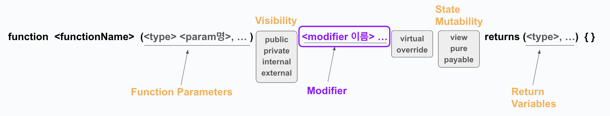
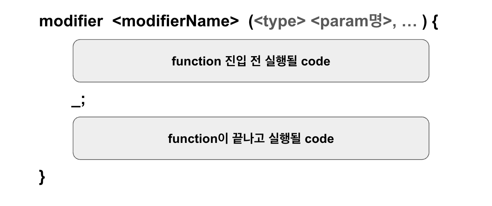

# Modifier



Function structure에서 modifier를 선택적으로 넣을 수 있는 구조를 봤을 것이다. 
modifier는 함수 실행 전/후 특정 조건을 검사하거나 추가 작업을 수행할 수 있는 기능을 맡는다. 

하나의 함수에서 여러 개의 modifier를 사용할 수 있으며, 띄어쓰기로 구분한다.   

Function Modifier는 접근을 제한하거나, 입력값을 검증하거나, 재진입(reentrancy) 공격을 방지하는 등의 목적으로 활용될 수 있다.

## modifier 선언


Modifier를 사용하기 위해서는, 함수에 적용하기 전에 Modifier 자체를 먼저 선언해야 한다. 

`_` 라는 키워드를 통해 다음 순서의 modifier를 실행시킨다. 다음 순서의 modifier가 없을 경우 비로소 함수 본문이 실행된다.     
따라서 `_` 전에 적힌 code는 함수 진입 전에 실행되며,   
`_` 후에 적힌 code는 함수 본문 실행이 끝난 후에 실행된다. 


- 여러 modifier는 함수 시그니처에 작성했던 순서대로 modifier가 실행된다. 
- 각 modifier 내부에서 `_`를 만나면 다음 modifier(없을 경우 함수 본문)가 실행되는 식이다. 
- 여러 modifier가 사용되었을 시에는 modifier 본문 내에서 `_` 를 만나면 modifier or function이 스택에 쌓이고, 실행 후 종료되면서 먼저 실행되었던 본문으로 돌아가 `_` 이후의 로직을 마무리 하는 식이다. 
- Modifier에서 return을 호출해도 함수 반환값에 영향을 미치지 않으며, 함수 본문 실행을 생략하면 기본값이 반환된다. 

## 예시
```solidity
// SPDX-License-Identifier: MIT
pragma solidity ^0.8.24;

contract FunctionModifier {
    address public owner;
    uint256 public x = 10;

    constructor() {
        //계약의 소유자를 컨트랙트를 처음 배포한 트랜잭션의 발신자로 설정.
        owner = msg.sender;
    }

    // 계약의 소유자인지 확인하는 modifier
    modifier onlyOwner() {
        require(msg.sender == owner, "Not owner");
        _; //함수 본문으로 대체됨.
    }

    // 입력된 주소가 유효한지 확인하는 수정자.
    modifier validAddress(address _addr) {
        require(_addr != address(0), "Not valid address");
        _;
    }

    // 소유자를 변경하는 함수.
    // 이 함수는 소유자만 호출할 수 있으며, (onlyOwner)
    //유효한 주소가 입력되어야 한다. (validAddres)
    function changeOwner(address _newOwner)
        public
        onlyOwner
        validAddress(_newOwner)
    {
        owner = _newOwner;
    }

    
}
```
### `constructor()`
```solidity
constructor() {
    owner = msg.sender;
}
```
`FunctionModifier` 라는 컨트랙트의 상태변수 `owner`에 컨트랙트 배포 트랜잭션의 발신자 주소를 넣는다. 

### function `changeOwner`
```solidity
function changeOwner(address _newOwner) public onlyOwner validAddress(_newOwner) {
    owner = _newOwner;
}
```
- `owner`의 값을 변경하며 새로운 소유자를 설정하는 함수다.   
- 실행 순서는 modifier `onlyOwner` -> modifier `validAddress` -> function `changeOwner`이다.   
- modifier `validAddress`의 파라미터 `_newOwner`는 function parameter `_newOwner`와 렌더링 된다. 

### modifier `onlyOwner`
```solidity
modifier onlyOwner() {
    require(msg.sender == owner, "Not owner");
    _;
}
```

- `changeOwner`함수가 호출 되면 제일 먼저 `onlyOwner` modifier가 호출되어, 함수 호출자가 현재 컨트랙트의 소유자인지 확인한다.   
- 현재 컨트랙트의 소유자가 아닐 경우, `"Not owner"`라는 에러 메세지와 함께 함수 호출은 반환된다.   
- 함수 호출자가 소유자가 맞을 경우, `_`가 실행되며, 다음 순서의 modifier인 `validAddress`가 호출된다. 

### modifier `validAddress`
```solidity
modifier validAddress(address _addr) {
    require(_addr != address(0), "Not valid address");
    _;
}
```

- function parameter로 받은 `_newOwnver` 의 값이 modifier `validArress`의 인자 `_addr`로 매핑되어, 입력된 주소가 유효한 주소인지 확인한다. 
- Solidity에서 `address(0)`은 주로 초기화 때 쓰는 값이다. 지금은 _addr에 초기화 값이 사용된게 아닌지 확인하는 중인 것이다. 
- 조건 검사를 통과하여 `_`를 만나면 다음 순서의 modifier는 없기 때문에 함수 본문이 실행된다. 
- 함수 본문이 끝나고 나면 다시 반대로 `validAddress`, `onlyOwner` 순서로 돌아와 `_` 이후의 code를 실행한다. 이 경우에는 두 modifier 모두 `_` 이후의 로직이 없으므로 함수 콜은 완전히 마무리 된다. 

---
## 예시2 (re-entrancy attack 방지)
Reentrancy Attack은 스마트 계약에서 함수 실행 중 외부 호출이 발생하고, 그 외부 호출이 다시 원래 함수를 호출함으로써 공유 상태(예: 잔액, 변수 값 등)를 오염시키는 공격이다. 
공유 자원에 여러 작업이 동시에 접근할 때 발생할 수 있다는 점에서 운영체제의 Race Condition과 굉장히 유사하다.   
Reentrancy Attack를 방지하기 위해 사용되는 Locking 메커니즘에는 여러가지 방법이 있지만, 여기서는 운영체제의 Mutex와 매우 유사한 방식인 lock 변수 활용법을 실습한다. 

```solidity
// SPDX-License-Identifier: MIT
pragma solidity ^0.8.24;  

contract FunctionModifier {
    bool public locked;

    // 함수가 실행 중일 때 재진입을 방지하는 modifier
    modifier noReentrancy() {
        require(!locked, "No reentrancy");

        locked = true;
        _;
        locked = false;
    }

    // 재진입 방지 기능이 적용된 함수
    function decrement(uint256 i) public noReentrancy {
        x -= i;

        if (i > 1) {
            decrement(i - 1);
        }
    }
}
```
### function `decrement` 
```solidity
function decrement(uint256 i) public noReentrancy {
    x -= i;

    if (i > 1) {
        decrement(i - 1);
    }
}
```

- 컨트랙트 상태 변수 x 값을 감소시키는 함수.
- `decrement(i - 1);` 재귀호출 시 modifier가 다시 실행된다. 

### modifier `noReentrancy` 
```solidity
modifier noReentrancy() {
    require(!locked, "No reentrancy");

    locked = true;
    _;
    locked = false;
}
```
- 재진입 공격을 방지하기 위한 modifier
- `locked` 변수 값을 스위치 하며 임계영역을 보호한다. 

>`locked` 변수는 한 명만 들어갈 수 있는 function의 문 잠금 상태라고 생각하면 편하다.  
`require(!locked, "No reentrancy");` 문이 열려있을 때에만 입장할 수 있으며  
`locked = true;` 문을 잠그고,   
`_;` 함수 입장  (이동안에는 locked 값이 true이므로 같은 함수로 재진입이 불가능하게 된다.)  
`locked = false;` `x` 값 수정을 마친 후 함수 밖으로 나오고 문을 열어둠 (이때부터 다른 트랜잭션 함수 진입 가능)

재귀호출 직전 `locked` 변수는 true 값을 갖고 있으므로 에러반환이 되어, 사실 재귀호출은 한번도 성공할 수 없는 함수이다. 
딱 한번 인자 `i`의 값만큼 `x`가 작아지고 `No reentrancy` 에러 메세지를 받게된다. 
