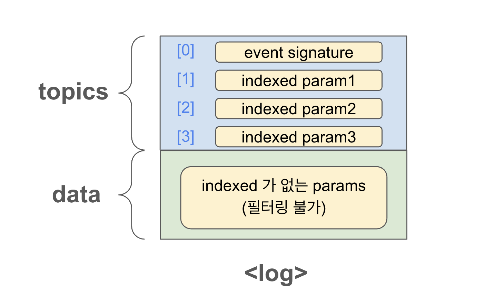
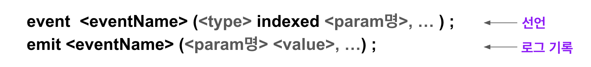
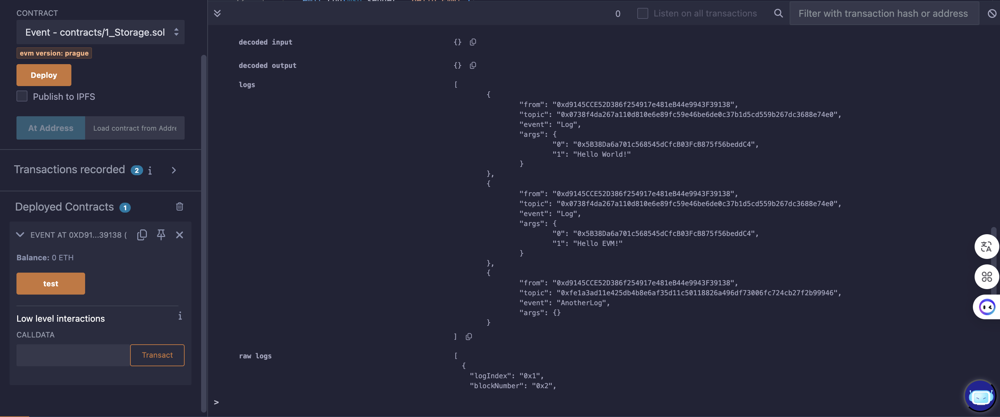

# Event

Solidity의 Event는 EVM의 **로그(logging)** 기능을 추상화한 것이다.  
스마트 계약의 상태 변경을 추적하고 외부 애플리케이션과 상호작용을 돕는 역할을 한다.

---

## 주요 특징

### 1. 블록체인 로그  
- 이더리움에서 **로그(log)**는 트랜잭션이 발생할 때 생성되는  데이터의 일종이다.
- 이벤트는 트랜잭션 로그로 저장되어 **블록체인에 영구적으로 기록**된다.  
- 로그는 **가볍고 저렴한 저장소 역할**을 하며, **컨트랙트 내부에서는 접근할 수 없고** 외부에서만 읽을 수 있다.


그림을 보면, 로그는 크게 두 부분으로 나뉜다. 
- **topics** : `indexed`로 설정된 데이터가 저장되는 영역
    - 로그의 상단 부분에 위치하며, 이벤트와 관련된 중요한 데이터를 저장한다.
    - `[0]` : 이벤트 시그니처가 keccak-256 해시값으로 저장됨
    - `[1] [2] [3]` : `indexed` 매개변수가 저장됨 (32-Byte 제한조건에 의해 필요에 따라 keccak-256 해시 되기도 한다.) 
    - topics 영역에 저장된 매개변수를 기준으로 **필터링과 검색이 가능**하다. 
- **data** : `indexed`가 없는 데이터가 저장되는 영역
    - topics 아래에 위치하며, indexed로 설정되지 않은 매개변수를 **ABI 인코딩**하여 저장한다. 
    - 이 데이터는 **필터링이 불가능**하며, 로그를 직접 조회해야만 확인할 수 있다. 
---

### 2. 이벤트 청취 및 필터링  
- 외부 애플리케이션(예: **웹3.js**)은 **RPC 인터페이스**를 통해 이벤트를 구독(`subscribe`)하고 청취(`listen`)할 수 있다.  
- 이때 특정 **컨트랙트 주소 및 토픽**을 기준으로 로그를 필터링할 수 있다.

---

### 3. 익명 이벤트 (Anonymous Events)  
- 이벤트 선언시 뒤에 `anonymous` 키워드를 쓰면, `topics[0]`에 시그니처 해시가 들어가지 않기 때문에 최대 4개까지 indexed 매개변수를 사용할 수 있게 된다. 
- 이벤트 이름 대신 **컨트랙트 주소로만 필터링**해야한다. 
- 배포 및 호출 비용이 더 저렴하지만, **시그니처 위조 가능성**이 있다.

---

### 4. Merkle Proof  
- 외부에서 **Merkle proof**를 제공하면, 컨트랙트는 로그가 **블록체인에 실제로 존재하는지 확인**할 수 있다.  
- 단, 컨트랙트는 **최근 256개의 블록 해시만 확인 가능**하다.

---

## 예시

### event 선언 및 호출법



**함수 밖**에서 `event` 키워드로 이벤트를 정의한다. (로그를 기록할 데이터의 구조를 정의)  
**함수 안**에서 `emit` 키워드로 앞서 정의된 파라미터 값들을 전달하며 이벤트를 호출한다. 

```solidity
// SPDX-License-Identifier: MIT
pragma solidity ^0.8.24;

contract Event {
    // 이벤트 선언
    event Log(address indexed sender, string message);
    event AnotherLog();

    function test() public {
        // 이벤트 호출
        emit Log(msg.sender, "Hello World!");
        emit Log(msg.sender, "Hello EVM!");
        emit AnotherLog();
    }
}
```
- **Log 이벤트** : 첫 매개변수 `sender`는 인덱싱되며, `msg.sender`와 메시지를 인자로 받아 로그를 기록한다.
- **AnotherLog 이벤트** : 매개변수가 없는 이벤트

## Remix 실습




컨트랙트 배포후 test 함수를 호출하면 로그에 이벤트 내용이 담기는 것을 확인할 수 있다. 