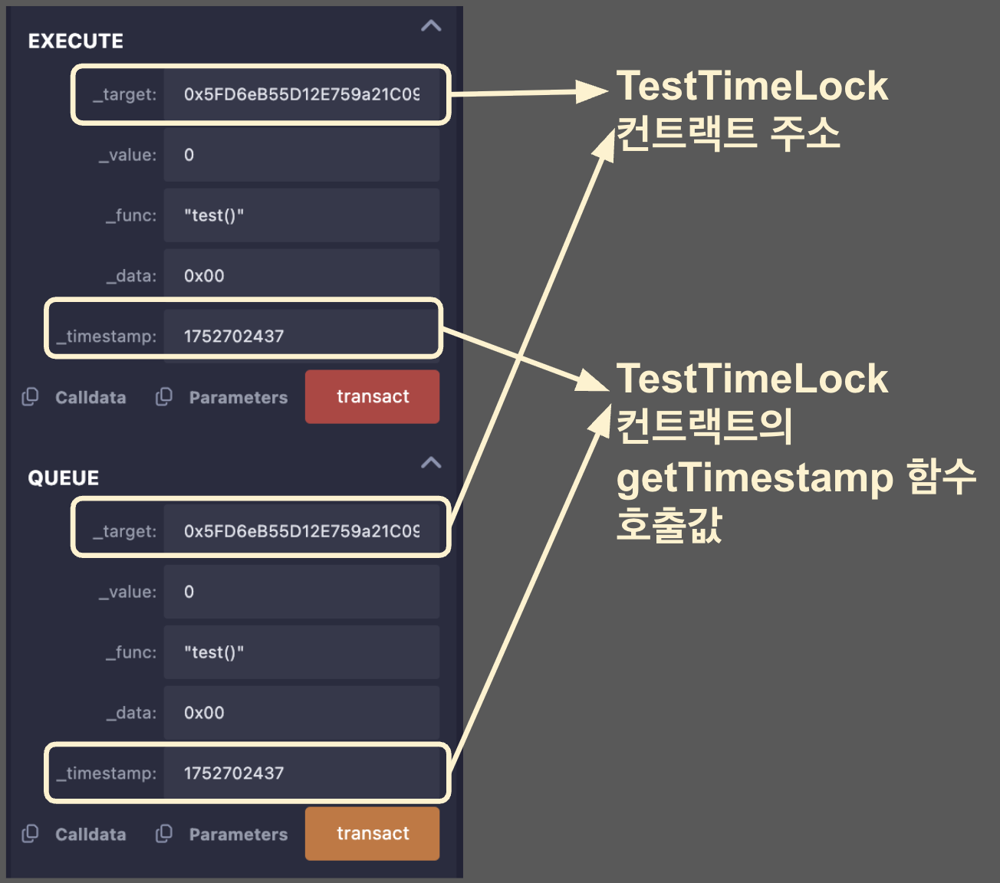

# timelock

특정 시간 이후에만 트랜잭션이 실행되도록 제한하는 것을 timelock 이라고 한다. Solidity에는 TimeLock이 문법이나 키워드로 존재하지 않는다. 그 대신, `block.timestamp` Global Variable를 활용하여 타임락 기능을 직접 구현한다. 

예를 들어, 일정 기간동안 자산을 잠가두었다가 미래의 특정 시점에만 실행되도록 할 수 있다. 
TimeLock은 보통 DAO에서 많이 사용된다. 

예시 코드를 직접 이해해보자.

### 예제 전체 코드
```solidity
// SPDX-License-Identifier: MIT
pragma solidity ^0.8.24;

contract TimeLock {
    error NotOwnerError();
    error AlreadyQueuedError(bytes32 txId);
    error TimestampNotInRangeError(uint256 blockTimestamp, uint256 timestamp);
    error NotQueuedError(bytes32 txId);
    error TimestampNotPassedError(uint256 blockTimestmap, uint256 timestamp);
    error TimestampExpiredError(uint256 blockTimestamp, uint256 expiresAt);
    error TxFailedError();

    event Queue(
        bytes32 indexed txId,
        address indexed target,
        uint256 value,
        string func,
        bytes data,
        uint256 timestamp
    );
    event Execute(
        bytes32 indexed txId,
        address indexed target,
        uint256 value,
        string func,
        bytes data,
        uint256 timestamp
    );
    event Cancel(bytes32 indexed txId);

    uint256 public constant MIN_DELAY = 10; // seconds
    uint256 public constant MAX_DELAY = 1000; // seconds
    uint256 public constant GRACE_PERIOD = 1000; // seconds

    address public owner;
    // tx id => queued
    mapping(bytes32 => bool) public queued;

    constructor() {
        owner = msg.sender;
    }

    modifier onlyOwner() {
        if (msg.sender != owner) {
            revert NotOwnerError();
        }
        _;
    }

    receive() external payable {}

    function getTxId(
        address _target,
        uint256 _value,
        string calldata _func,
        bytes calldata _data,
        uint256 _timestamp
    ) public pure returns (bytes32) {
        return keccak256(abi.encode(_target, _value, _func, _data, _timestamp));
    }

    /**
     * @param _target 호출하려는 contract or account 주소
     * @param _value 보내려는 ETH의 양
     * @param _func Function signature(함수 서명), 예를 들어, "foo(address,uint256)"
     * @param _data ABI 인코딩된 데이터.
     * @param _timestamp 트랜잭션이 실행되고 난 후의 timestamp.
     */
    function queue(
        address _target,
        uint256 _value,
        string calldata _func,
        bytes calldata _data,
        uint256 _timestamp
    ) external onlyOwner returns (bytes32 txId) {
        txId = getTxId(_target, _value, _func, _data, _timestamp);
        if (queued[txId]) {
            revert AlreadyQueuedError(txId);
        }
        // ---|------------|---------------|-------
        //  block    block + min     block + max
        if (
            _timestamp < block.timestamp + MIN_DELAY
                || _timestamp > block.timestamp + MAX_DELAY
        ) {
            revert TimestampNotInRangeError(block.timestamp, _timestamp);
        }

        queued[txId] = true;

        emit Queue(txId, _target, _value, _func, _data, _timestamp);
    }

    function execute(
        address _target,
        uint256 _value,
        string calldata _func,
        bytes calldata _data,
        uint256 _timestamp
    ) external payable onlyOwner returns (bytes memory) {
        bytes32 txId = getTxId(_target, _value, _func, _data, _timestamp);
        if (!queued[txId]) {
            revert NotQueuedError(txId);
        }
        // ----|-------------------|-------
        //  timestamp    timestamp + grace period
        if (block.timestamp < _timestamp) {
            revert TimestampNotPassedError(block.timestamp, _timestamp);
        }
        if (block.timestamp > _timestamp + GRACE_PERIOD) {
            revert TimestampExpiredError(
                block.timestamp, _timestamp + GRACE_PERIOD
            );
        }

        queued[txId] = false;

        // 데이터 준비
        bytes memory data;
        if (bytes(_func).length > 0) {
            // data = func selector + _data
            data = abi.encodePacked(bytes4(keccak256(bytes(_func))), _data);
        } else {
            // 데이터를 가진 fallback 호출
            data = _data;
        }

        // target 호출
        (bool ok, bytes memory res) = _target.call{value: _value}(data);
        if (!ok) {
            revert TxFailedError();
        }

        emit Execute(txId, _target, _value, _func, _data, _timestamp);

        return res;
    }

    function cancel(bytes32 _txId) external onlyOwner {
        if (!queued[_txId]) {
            revert NotQueuedError(_txId);
        }

        queued[_txId] = false;

        emit Cancel(_txId);
    }
}
contract TestTimeLock{
    address public timeLock;
    constructor(address _timeLock){
        timeLock = _timeLock;
    }
    function test() view external {
        require(msg.sender == timeLock, "not timelock");
    }

    function getTimestamp() external view returns (uint){
        return block.timestamp +100;
    }
}
```

### 1. lisence, pragma 버전 설정
> lisence: MIT 컴파일 버전: ^0.8.24
```solidity
// SPDX-License-Identifier: MIT
pragma solidity ^0.8.24;
```

### 2. TimeLock contract
> error  
> - `NotOwnerError`: 소유자가 아닌 사람이 소유자 전용 함수를 호출했을 때 발생한다.
> - `AlreadyQueuedError`: 이미 queue에 등록된 트랜잭션 ID(txId)를 queue에 등록하려고 할 때 발생한다.
> - `TimestampNotInRangeError`: 제공된 타임스탬프가 허용된 범위(현재 블록 타임스탬프 + MIN_DELAY와 현재 블록 타임스탬프 + MAX_DELAY 사이) 내에 있지 않을 때 발생한다.
> - `NotQueuedError`: 큐에 없는 트랜잭션 ID(txId)를 취소하거나 실행하려고 할 때 발생한다.
> - `TimestampNotPassedError`: 트랜잭션을 실행하려고 할 때 아직 타임스탬프가 지나지 않았을 때 발생한다.
> - `TimestampExpiredError`: 트랜잭션을 실행하려고 할 때 타임스탬프가 만료되었을 때 발생한다.
> - `TxFailedError`: 트랜잭션이 실패했을 때 발생한다.
```solidity
error NotOwnerError();
error AlreadyQueuedError(bytes32 txId);
error TimestampNotInRangeError(uint256 blockTimestamp, uint256 timestamp);
error NotQueuedError(bytes32 txId);
error TimestampNotPassedError(uint256 blockTimestmap, uint256 timestamp);
error TimestampExpiredError(uint256 blockTimestamp, uint256 expiresAt);
error TxFailedError();
```

> event
> - `Queue`: 트랜잭션이 큐에 등록될 때 발생한다.
> - `Execute`: 트랜잭션이 성공적으로 실행될 때 발생한다.
> - `Cancel`: 트랜잭션이 취소될 때 발생한다.
```solidity
event Queue(
        bytes32 indexed txId,
        address indexed target,
        uint256 value,
        string func,
        bytes data,
        uint256 timestamp
    );
    event Execute(
        bytes32 indexed txId,
        address indexed target,
        uint256 value,
        string func,
        bytes data,
        uint256 timestamp
    );
event Cancel(bytes32 indexed txId);
```

> 상수/변수
> - `MIN_DELAY`: 최소 지연 시간
> - `MAX_DELAY`: 최대 지연 시간
> - `GRACE_PERIOD`: 거래가 만료되기 전까지의 추가 시간
> - `owner`: 컨트랙트 소유자의 주소
> - `queued`: 트랜잭션 ID(txId)가 queue에 등록되었는지 여부를 저장하는 mapping
```solidity
uint256 public constant MIN_DELAY = 10; // seconds
uint256 public constant MAX_DELAY = 1000; // seconds
uint256 public constant GRACE_PERIOD = 1000; // seconds

address public owner;

// tx id => queued
mapping(bytes32 => bool) public queued;
```

> function
> - `constructor`: 컨트랙트를 배포할 때 호출되며, 호출자(msg.sender)를 소유자(owner)로 설정한다.
> - `onlyOwner`: 이 modifier를 사용하는 함수는 오직 소유자만 호출할 수 있다. 소유자가 아니면 `NotOwnerError`를 발생시킨다.
> - `receive`: Ether를 받을 때 사용한다.
> - `getTxId`: 주어진 매개변수에 따라 트랜잭션 ID(txId)를 생성한다. `txId`는 `_target`(대상 주소), `_value`(전송할 ETH의 양), `_func`(함수 서명), `_data`(ABI 인코딩된 데이터), `_timestamp`(타임스탬프)을 해시하여 생성한다.
> - `queue`  
    >> - 트랜잭션을 queue에 등록한다.
    >> - 트랜잭션 ID를 생성하고 이미 queue에 있으면 `AlreadyQueuedError`오류 발생.
    >> - `_timestamp`가 현재 시간에서 최소 지연 시간(`MIN_DELAY`)와 최대 지연 시간(`MAX_DELAY`) 범위 내에 있지 않으면 `TimestampNotInRangeError`오류 발생.
    >> - 트랜잭션을 queue에 등록하고 `Queue` 이벤트를 발생시킨다.
> - `execute` 
    >> - queue에 등록된 트랜잭션를 실행한다.
    >>- 트랜잭션 ID를 확인하고 queue에 있는지 확인하고 없으면 `NotQueuedError`오류 발생.
    >> - 현재 시간이 `_timestamp` 이전이면 `TimestampNotPassedError`오류 발생.
    >> - 현재 시간이 `_timestamp` + `GRACE_PERIOD` 이후이면 `TimestampExpiredError`오류 발생.
    >> - 트랜잭션을 실행하고 성공 여부를 확인한다. `Execute` 이벤트를 발생시킨다.
        >>> - `abi.encodePacked(bytes4(keccak256(bytes(_func))), _data);` : `_func` 함수와 그 인자를 결합하여, 스마트 컨트랙트의 특정 함수를 호출하기 위한 데이터 포맷을 생성함.
        >>> - `_target.call{value: _value}(data);` : `call`은  Solidity에서 외부 컨트랙트의 함수를 호출하는 방법 중 하나이다. 호출할 데이터와 함께 Ether를 전송할 수 있으며, 호출 결과로 반환된 데이터는 `bytes memory res`에, 호출이 성공 여부는 `bool ok`에 담긴다. 
    
> - `cancel`
    >> - queue에 등록된 트랜잭션을 취소한다. 
    >> - 트랜잭션 ID를 확인하고 queue에 있는지 확인한다. 
    >> - queue에서 트랜잭션을 제거하고 Cancel 이벤트를 발생시킨다.
```solidity
constructor() {
    owner = msg.sender;
}

modifier onlyOwner() {
        if (msg.sender != owner) {
            revert NotOwnerError();
        }
        _;
}

receive() external payable {}

function getTxId(
        address _target,
        uint256 _value,
        string calldata _func,
        bytes calldata _data,
        uint256 _timestamp
) public pure returns (bytes32) {
    return keccak256(abi.encode(_target, _value, _func, _data, _timestamp));
}
function queue(
        address _target,
        uint256 _value,
        string calldata _func,
        bytes calldata _data,
        uint256 _timestamp
) external onlyOwner returns (bytes32 txId) {
  txId = getTxId(_target, _value, _func, _data, _timestamp);
  if (queued[txId]) {
      revert AlreadyQueuedError(txId);
  }

  if (
      _timestamp < block.timestamp + MIN_DELAY
      || _timestamp > block.timestamp + MAX_DELAY
  ) {
      revert TimestampNotInRangeError(block.timestamp, _timestamp);
  }

  queued[txId] = true;

  emit Queue(txId, _target, _value, _func, _data, _timestamp);
  }

function execute(
        address _target,
        uint256 _value,
        string calldata _func,
        bytes calldata _data,
        uint256 _timestamp
) external payable onlyOwner returns (bytes memory) {
  bytes32 txId = getTxId(_target, _value, _func, _data, _timestamp);
  if (!queued[txId]) {
      revert NotQueuedError(txId);
  }

  if (block.timestamp < _timestamp) {
      revert TimestampNotPassedError(block.timestamp, _timestamp);
  }
  if (block.timestamp > _timestamp + GRACE_PERIOD) {
      revert TimestampExpiredError(
          block.timestamp, _timestamp + GRACE_PERIOD
      );
  }

  queued[txId] = false;

  bytes memory data;
  if (bytes(_func).length > 0) {
      data = abi.encodePacked(bytes4(keccak256(bytes(_func))), _data);
  } else {
      data = _data;
  }

  (bool ok, bytes memory res) = _target.call{value: _value}(data);
  if (!ok) {
      revert TxFailedError();
  }

  emit Execute(txId, _target, _value, _func, _data, _timestamp);

  return res;
}

function cancel(bytes32 _txId) external onlyOwner {
    if (!queued[_txId]) {
        revert NotQueuedError(_txId);
    }

    queued[_txId] = false;

    emit Cancel(_txId);
}

```

### 3. TestTimeLock 컨트랙트
> - `timeLock` : 외부 `TimeLock` 컨트랙트의 주소를 저장
> - `test` 외부호출 당할 함수. 호출자의 주소가, timeLock 주소랑 같은지 확인
> - `getTimestamp` 현재 블록의 타임스탬프에 100초를 더한 값을 반환
```solidity
contract TestTimeLock{
    address public timeLock;
    constructor(address _timeLock){
        timeLock = _timeLock;
    }
    function test() view external {
        require(msg.sender == timeLock, "not timelock");
    }

    function getTimestamp() external view returns (uint){
        return block.timestamp +100;
    }
}
```


---
1. 전체 코드를 컴파일한 후에, `TimeLock` 컨트랙트를 먼저 배포한다. 
2. `TimeLock` 컨트랙트의 주소를 복사하여, `TestTimeLock` 컨트랙트의 생성자 파라미터로 붙여넣고 배포한다. 
3. `Queue` `Excute`파라미터 설정

4. `Queue` 호출 후 바로 `Excute` 호출해보기.  
-> TestTimeLock에서 getTimestamp에서 타임스탬프의 100초를 더한 값을 반환하기 때문에 queue를 transact한 후 100초가 지나기 전에 execute를 하면 오류가 발생 해야 마음. 
5. 100 초 후 `Excute` 호출하면 성공함