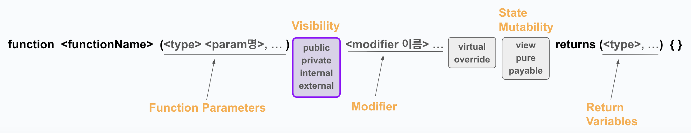
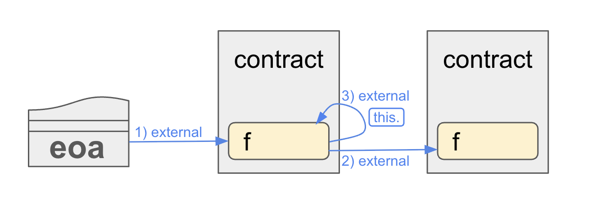
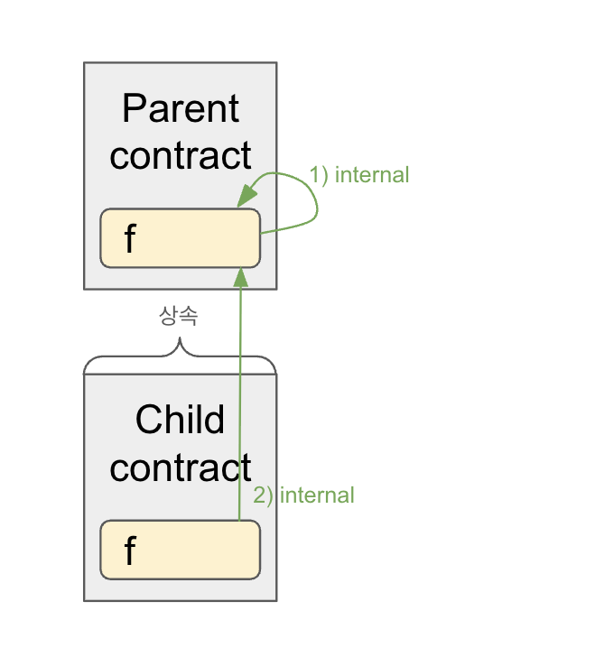
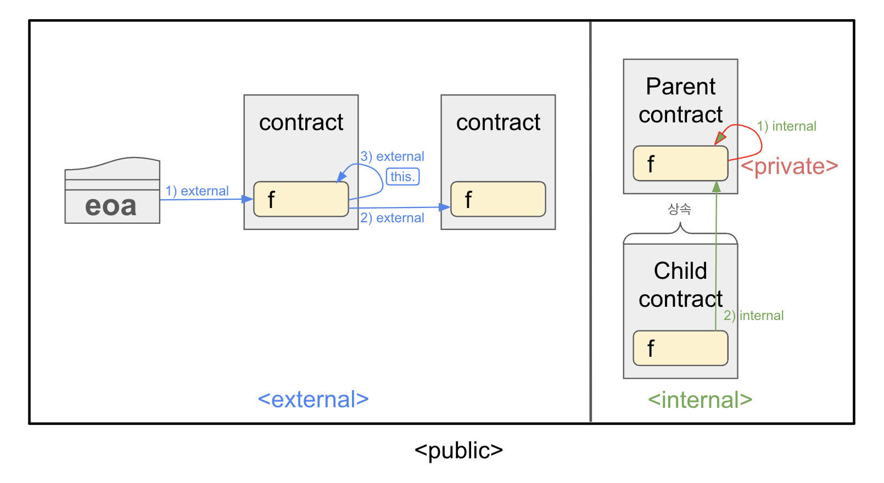

# Visibility

Solidity는 함수를 호출하는 방식을 내부 호출/외부 호출로 나누며,
그에 따른 **함수의 가시성**을 네 가지로 분류한다. 

---
## External Call - 외부 호출


- **EVM에서 Message Call을 생성**하여 컨트랙트 주소를 통해 함수에 접근하는 것을 외부호출이라고 한다.
→ 다른 컨트랙트에 있는 함수를 **주소를 통해 호출**
  1. 외부 트랜잭션으로 EOA(Externally Owned Account)가 컨트랙트의 함수를 호출  
  2. 다른 컨트랙트에 있는 함수를 호출  
  3. 같은 컨트랙트 내의 함수를 `this`로 호출  

### 특징
- 함수를 호출할 때 EVM에서 Message Call을 생성한다.  
- ABI를 통해 실행된다.  
- 컨트랙트 주소를 통해 접근.  


## Internal Call - 내부 호출

- **Message Call 없이 직접 함수 실행**  
  1. 같은  컨트랙트 내부에서 직접 함수를 호출 
  2. 상속 관계에서 자식 컨트랙트가 부모 컨트랙트의 함수를 호출

### 특징
- EVM에서 Message Call을 생성 하지 않고 동일한 컨트랙트 코드 흐름 안에서 바로 실행된다.
- ABI 인코딩/디코딩이 필요하지 않으며, 가스비(호출비용)이 낮다.

---
---

# 함수 visibility

`external` `public` `internal` `private`  
각각의 키워드로 선언된 함수는 다음과 같은 특징을 같는다. 

### `external`
- 다른 컨트랙트, 트랜잭션을 통해 호출 가능.
- 내부에서 직접 호출 `f()` 불가. 대신에 해당 함수를 정의한 컨트랙트 내부에서는 `this.f()`를 통해 호출 가능.
- 주로 **외부 인터페이스**로 사용됨.
```solidity
function externalFunc() external pure returns (string memory) {
    return "external function called";
}
```
---

### `public`
- 외부 호출 및 내부 호출 모두 가능.
> **상태 변수**에 대해 `public`으로 선언하면 **자동으로 Getter 함수**가 생성됨.
```solidity
function publicFunc() public pure returns (string memory) {
    return "public function called";
}
```
---

### `internal`
- 현재 컨트랙트 및 상속받은 컨트랙트에서만 호출 가능.
- `this` 없이 **직접 호출 가능**.
> 상태 변수의 **기본 가시성**.
```solidity
function internalFunc() internal pure returns (string memory) {
    return "internal function called";
}
```
---

### `private`
- 오직 해당 함수를 정의한 컨트랙트 내부에서만 호출 가능.
```solidity
function privateFunc() private pure returns (string memory) {
    return "private function called";
}
```

# 상태변수 visibility
상태변수는 `external`를 재외한 `public` `internal` `private` 가시성을 가질 수 있다.

### `public`
- 모든 컨트랙트와 계정에서 접근할 수 있다. 
- 상태 변수를 `public`으로 선언하면 **자동으로 Getter 함수**가 생성된다. 

``` solidity
uint public publicNumber; // Getter 함수 자동 생성
```

### `internal`
- 상태 변수의 기본 가시성으로, 명시적으로 가시성을 지정하지 않으면 상태변수는 internal 변수가 된다. 
- 해당 컨트랙트와 이를 상속받은 컨트랙트에서 접근할 수 있다. 
- 외부 컨트랙트나 계정에서는 접근 불가.
``` solidity
uint internal internalNumber;
```

### `private`
- 오직 해당 변수를 정의한 컨트랙트 내부에서만 접근할 수 있다. 
- 상속받은 컨트랙트에서도 접근 불가.

``` solidity
uint private privateNumber;
```
---
---

### 실습 예제

**전체 예제 코드**
```solidity
// SPDX-License-Identifier: MIT
pragma solidity ^0.8.24;

contract Base {
    // Private function can only be called
    // - inside this contract
    // Contracts that inherit this contract cannot call this function.
    function privateFunc() private pure returns (string memory) {
        return "private function called";
    }

    function testPrivateFunc() public pure returns (string memory) {
        return privateFunc();
    }

    // Internal function can be called
    // - inside this contract
    // - inside contracts that inherit this contract
    function internalFunc() internal pure returns (string memory) {
        return "internal function called";
    }

    function testInternalFunc() public pure virtual returns (string memory) {
        return internalFunc();
    }

    // Public functions can be called
    // - inside this contract
    // - inside contracts that inherit this contract
    // - by other contracts and accounts
    function publicFunc() public pure returns (string memory) {
        return "public function called";
    }

    // External functions can only be called
    // - by other contracts and accounts
    function externalFunc() external pure returns (string memory) {
        return "external function called";
    }

    // This function will not compile since we're trying to call
    // an external function here.
    // function testExternalFunc() public pure returns (string memory) {
    //     return externalFunc();
    // }

    // State variables
    string private privateVar = "my private variable";
    string internal internalVar = "my internal variable";
    string public publicVar = "my public variable";
    // State variables cannot be external so this code won't compile.
    // string external externalVar = "my external variable";
}

contract Child is Base {
    // Inherited contracts do not have access to private functions
    // and state variables.
    // function testPrivateFunc() public pure returns (string memory) {
    //     return privateFunc();
    // }

    // Internal function can be called inside child contracts.
    function testInternalFunc() public pure override returns (string memory) {
        return internalFunc();
    }
}
```
> Remix에 접속하여 각 단계별로 주석을 풀거나 가시성 수준을 변경하며 코드를 수정해보자. 

1. `Base` 컨트랙트의 `testExternalFunc` 함수 주석 해제
```solidity
// This function will not compile since we're trying to call
// an external function here.
function testExternalFunc() public pure returns (string memory) {
    return externalFunc();
}
```
위처럼 `testExternalFunc` 함수 주석을 해제하고 컴파일을 시도하면,  `external` 함수인 `externalFunc`를 같은 컨트랙트 내부에서 직접 호출할 수 없기 때문에 컴파일 에러가 난다.  
`external`함수를 같은 컨트랙트에서 호출하려면 `this.externalFunc()`와 같이 외부호출로 접근해야한다. 

---
2. `Child` 컨트랙트의 `testPrivateFunc` 함수 주석 해제
```solidity
// Inherited contracts do not have access to private functions
// and state variables.
function testPrivateFunc() public pure returns (string memory) {
    return privateFunc();
}
```
`Child` 컨트랙트의 `testPrivateFunc` 함수 주석을 해제하고 컴파일을 시도해보자.  `Base`컨트랙트의 `private` 함수인 `privateFunc()`에는 `Base`를 상속받은 `Child` 컨트랙트에서 접근 할 수 없기 때문에 컴파일 에러가 난다. 

---
3. `Base` 컨트랙트에서 상태변수 접근 함수 추가
```solidity
contract Base {
    // Existing code...

    // State variables
    string private privateVar = "my private variable";
    string internal internalVar = "my internal variable";
    string public publicVar = "my public variable";

    // Getter functions for state variables
    function getPrivateVar() public view returns (string memory) {
        return privateVar;
    }

    function getInternalVar() public view returns (string memory) {
        return internalVar;
    }

    // publicVar는 자동으로 getter 함수가 생성됨
}
```
`getPrivateVar`와 `getInternalVar` 함수를 호출하여 각각의 상태 변수 값을 확인한다.
publicVar는 **자동으로 생성된** getter 함수를 통해 접근.

---
4. `Base` 컨트랙트에서 함수 가시성 변경
```solidity
contract Base {
    // Changing visibility levels for testing

    // Change privateFunc to internal
    function privateFunc() internal pure returns (string memory) {
        return "private function called";
    }

    // Change internalFunc to public
    function internalFunc() public pure returns (string memory) {
        return "internal function called";
    }

    // Change publicFunc to external
    function publicFunc() external pure returns (string memory) {
        return "public function called";
    }

    // Existing code...
}
```
함수 가시성을 변경한 후 각 함수를 호출하여 동작 확인. 변경된 가시성에 따라 호출 가능 여부, 반환값을 확인해보자.

---
5. `Child` 컨트랙트에서 부모 컨트랙트 함수 호출
```solidity
contract Child is Base {
    // Call public function from Base (changed to external in this case)
    function callParentPublicFunc() public view returns (string memory) {
        return publicFunc();
    }
}
```
`publicFun`의 가시성이 `external`로 변경되었기 때문에, 직접 호출(internal)할 수 없음을 확인한다.