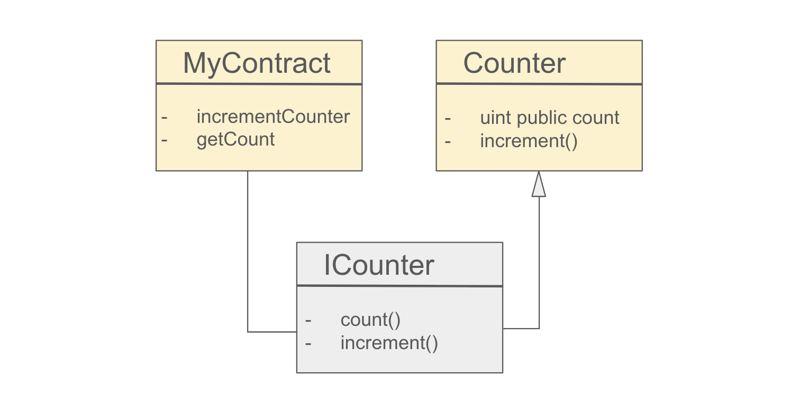

# Interface

**Interface**는 **Solidity**에서 추상화된 형태의 계약으로, 스마트 계약이 어떻게 상호작용 할 수 있는지를 명확하게 정의하는 역할을 한다. 이는 다른 스마트 컨트랙트가 해당 인터페이스를 구현하는 방식을 강제하지 않으면서도 일관된 방법으로 상호 작용 할 수 있게 한다.

- 함수의 시그니처만 포함하고, 함수의 구현은 포함하지 않는다.
- 생성자(`constructor`), 상태변수(`state variable`), 수정자(`modifier`) 선언 불가.
- 인터페이스는 다른 계약을 상속할 순 없지만, 인터페이스끼리의 상속은 가능하다.
- 인터페이스 내의 함수는 반드시 `external` 가시성을 가져야 한다.
- 모든 함수는 암묵적 `virtual`이며, 재정의 시 `override` 키워드 생략 가능.

**ABI**(Contract Application Binary Interface)와 직접적으로 매핑되며, ABI와의 정보 손실 없이 변환 가능하다.

```solidity 
// SPDX-License-Identifier: MIT
pragma solidity ^0.8.24;

// 간단한 Counter를 구현한 contract
contract Counter {
    uint256 public count;

    function increment() external {
        count += 1;
    }
}

// ICounter interface를 사용하여 Counter contract과 상호 작용하는 contract
interface ICounter {
    function count() external view returns (uint256);
    function increment() external;
}

contract MyContract {
    function incrementCounter(address _counter) external {
        ICounter(_counter).increment();
    }

    function getCount(address _counter) external view returns (uint256) {
        return ICounter(_counter).count();
    }
}
```


> interface는 실행 가능한 코드가 없고 단지 함수 시그니처를 정의하는 "약속" 역할을 하기 때문에 배포할 필요가 없다. interface 정의는 해당 인터페이스를 사용하는 컨트랙트를 컴파일할 때 포함만 되면 된다.    
---> Counter, MyContract만 배포하세요

## Counter 컨트랙트

**Counter contract**는 `count` 값을 관리하고 증가시키는 기능을 제공한다.

- `public` 변수 `count`는 자동 getter 함수 생성.
- `count` 상태 변수를 증가시키는 `increment` 함수.

---

## ICounter 인터페이스

**ICounter** 인터페이스는 **Counter** 계약의 함수와 상호작용하기 위해 사용된다.

- `count()` : `count` 값을 읽는 함수.
- `increment()`: `count` 상태변수를 증가시키는 함수.

실제 컨트랙트의 함수명과 매개변수 타입이 정확히 일치해야 한다.  
인터페이스 내의 함수는 반드시 `external` 가시성을 가져야 한다.

---

## MyContract 컨트랙트

**MyContract** 컨트랙트는, **ICounter** 인터페이스를 통해 **Counter** 계약과 상호작용한다.

### `incrementCounter(address _counter)`

- **매개변수:** `_counter`는 외부 Counter 계약의 주소를 전달받는다.
- ` ICounter(_counter).increment()`  
    - **기능:** 전달받은 주소를 **ICounter** 타입으로 캐스팅하여 해당 주소에 있는 계약의 `increment` 함수를 호출.  
    (해당 주소가 **ICounter** 인터페이스를 준수한다고 가정한다. 안맞을 시엔 런타임 에러 발생)
- 결과적으로 외부 Counter 계약의 `count` 값이 증가.


### `getCount(address _counter)`

- **매개변수:** `_counter`는 외부 Counter 계약의 주소를 전달받는다.
- `ICounter(_counter).count()`
  - **기능:** 전달받은 주소를 **ICounter** 타입으로 캐스팅하여 해당 주소에 있는 계약의 `count` 값을 조회한다.
- 조회된 값을 반환.


---
## Abstract Contracts vs Interface
- **Abstract Contracts** : 최소한 하나의 구현되지 않은 함수를 포함하며, 직접 컴파일할 수 없다. 다른 계약이 이를 상속하여 사용할 수 있다.  
- **Interface** : 어떠한 함수도 구현할 수 없으며, ABI가 표현할 수 있는 것에 제한된다. ABI와의 변환이 손쉽고 정보 손실이 없다.