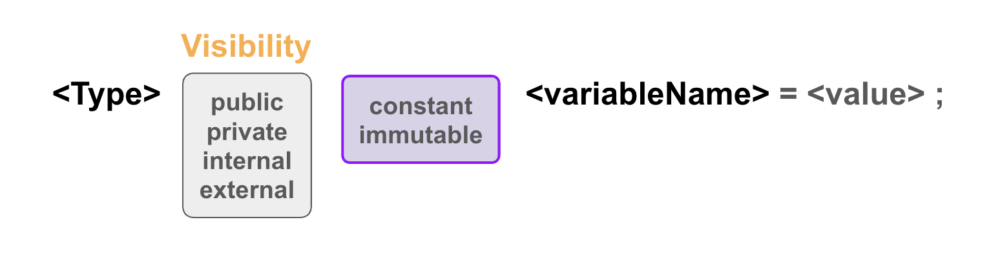

# Constant / Immutable



solidity에서 상수를 선언하는 방법은 `constant`, `immutable` 두가지가 있다. 이렇게 선언된 두 변수는 컨트랙트가 생성된 이후 수정이 불가능하며, 저장 슬롯을 사용하지 않아 가스비용이 낮다. 

## Constant
**컴파일 시점에 고정**된다.  
- 선언 시 바로 값을 할당해야 한다.  
- 초기화 값은 리터럴이어야 한다. 예를 들어, 숫자, 문자열, 주소 등을 직접 입력해야 한다.  
- 컴파일러가 변수의 값을 코드 내 **모든 참조 위치에 복사**하여 사용한다.  
-> 직접 **하드코딩** 되어있어 런타임에 접근비용 거의 들지 X

## Immutable
컨트랙트 생성 시점(constructor) 또는 선언 시에 할당될 수 있다. 한번 설정된 후에는 변경할 수 없다. 
- 선언할 때 초기화하지 않아도 된다. 대신, constructor에서 값을 설정할 수 있다.
- 초기화 값은 동적일 수 있다. 예를 들어, constructor의 매개변수로 전달받은 값을 사용하여 초기화할 수 있다.
- 할당된 이후에는 읽기 전용으로 사용된다. 
- 생성 시점에 한 번 평가된 후, 컨트랙트 런타임 코드에 값이 복사된다. 모든 참조 위치에 값을 복사하며 항상 32바이트다.  
-> 스토리지 접근 X, **런타임 코드 내에서 메모리 슬롯**을 통해 참조되므로 가스비용이 낮아짐. (그래도 여전히 constant보단 비쌈)

> Constant: 컴파일 시점에서 변하지 않는 값을 정의할 때 사용.  
Immutable: 컨트랙트 생성 시 환경에 따라 값이 결정되며, 이후 변경되지 않는 값을 정의할 때 사용.

---

### 예제코드
### Constant

```solidity
// SPDX-License-Identifier: MIT
pragma solidity ^0.8.24;

contract Constants {
    address public constant MY_ADDRESS =
        0x777788889999AaAAbBbbCcccddDdeeeEfFFfCcCc;
    uint256 public constant MY_UINT = 123;
}
```
`MY_ADDRESS`, `MY_UINT`
`constant` 로 선언된 이 변수들은 컴파일 시점에 초기화 되고, 변경할 수 없음

### Immutable
```solidity
// SPDX-License-Identifier: MIT
pragma solidity ^0.8.24;

contract Immutable {
    address public immutable MY_ADDRESS;
    uint256 public immutable MY_UINT;

    constructor(uint256 _myUint) {
        MY_ADDRESS = msg.sender;
        MY_UINT = _myUint;
    }
}
```

`MY_ADDRESS` `MY_UINT` 변수는 constructor에서 한 번 설정된 수 변경할 수 없음 