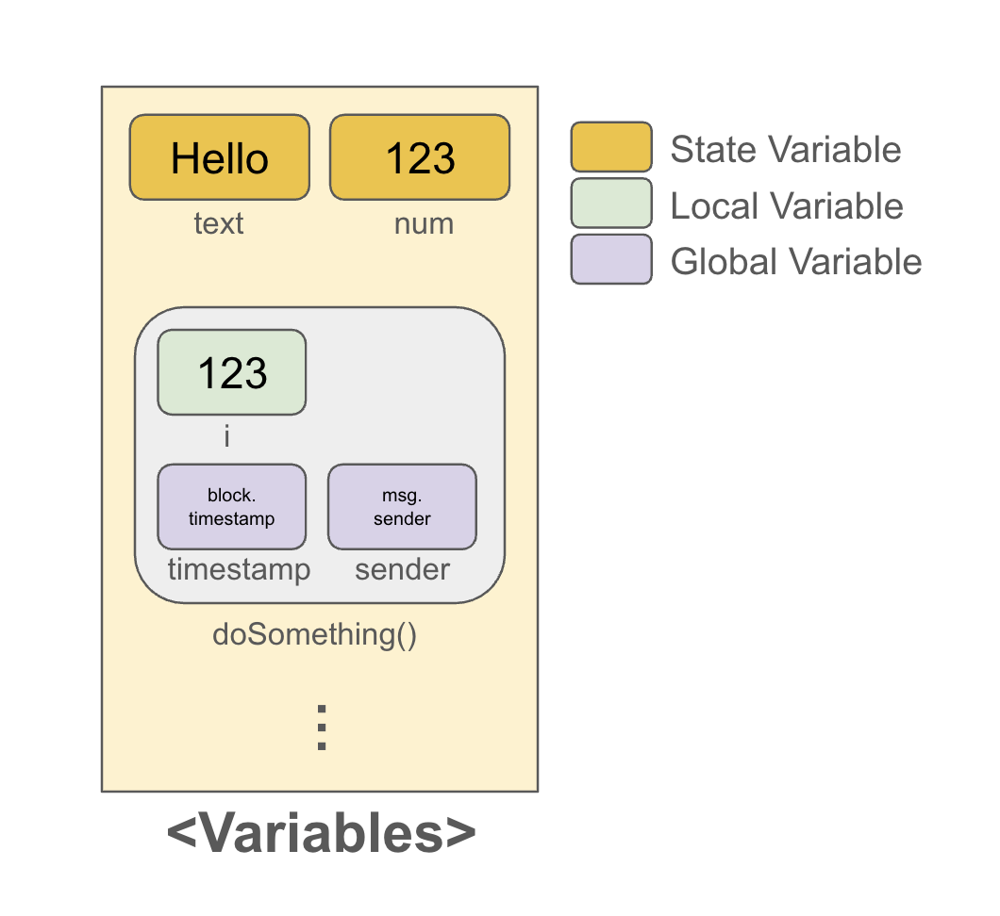

# Variable
Solidity의 변수 종류에는 `Local Variable`, `State Variable`, `Global Variable` 3가지가 있다. 

## Local Variable
`Local Variable`는 함수 내부에서 사용되는 변수다. 이 변수들은 블록체인에 영구적으로 저장되지 않으며, 함수 실행 중에만 존재한다.
* **일시적 저장** : 함수가 실행될 때 메모리에 할당되고, 함수 실행이 끝나면 사라진다.
* **가스 비용** : 상대적으로 적은 가스 비용이 발생한다.
* **지역 접근** : 이 변수가 선언된 함수 내에서만 접근할 수 있으며, 같은 Contract의 다른 함수에서도 접근할 수 없다. 

## State Variable
`State Variable`(State 변수)는 Smart Contract의 상태를 저장하는 데 사용되는 변수다. 이 변수들은 블록체인에 영구적으로 저장되며, 계약의 상태를 나타내는 중요한 요소다.

* **영구 저장** : 블록체인에 저장되기 때문에, 트랜잭션이 종료된 후에도 그 값이 유지된다.
* **가스 비용** : State Variable를 작성하는 것은 가스 비용을 수반한다.
* **전역 접근** : State Variable는 같은 Contract의 모든 함수에서 접근할 수 있다. 같은 Contract의 다양한 함수들이 같은 State를 공유한다.

## Global Variable
`Global Variable`은 함수나 계약 내에서 언제든지 사용할 수 있는 미리 정의된 변수들이다. 블록체인, 계약, 트랜잭션 데이터를 제공한다. 

**Global Variable 예시**

- `block.coinbase (address)`: 현재 블록의 채굴자 주소를 반환한다.
- `block.difficulty (uint)`: 현재 블록의 난이도를 반환한다.
- `block.gaslimit (uint)`: 현재 블록의 가스 한도를 반환한다.
- `block.number (uint)`: 현재 블록 번호를 반환한다.
- `block.timestamp (uint)`: 현재 블록의 타임스탬프(초 단위)를 반환한다.
- `msg.data (bytes)`: 호출된 데이터(payload)를 반환한다.
- `msg.sender (address)`: 메시지를 보낸 사람(호출자)의 주소를 반환한다.
- `msg.sig (bytes4)`: 호출된 함수의 첫 4바이트(함수 식별자)를 반환한다.
- `msg.value (uint)`: 호출 시 전송된 이더의 양을 반환한다.
- `tx.gasprice (uint)`: 트랜잭션의 가스 가격을 반환한다.
- `tx.origin (address)`: 트랜잭션을 시작한 사람의 주소를 반환한다.

---
### 예제
```solidity
// SPDX-License-Identifier: MIT
pragma solidity ^0.8.24;

contract Variables {
    // State variable들은 블록체인에 저장된다.
    string public text = "Hello";
    uint256 public num = 123;

    function doSomething() public {
        // Local variable들은 블록체인에 저장되지 않는다.
        uint256 i = 456;

        // Global variable들은 아래와 같이 사용되어 원하는 데이터를 가져올 수 있다.
        uint256 timestamp = block.timestamp; // 현재 블록의 타임스탬프
        address sender = msg.sender; // 컨트랙트 호출자의 주소
    }

    // State Variable 읽기 및 쓰기 함수
    function setNum(uint256 _num) public {
        num = _num;
    }

    function getNum() public view returns (uint256) {
        return num;
    }

    // Global Variable 사용 함수
    function getBlockInfo() public view returns (uint256, uint256) {
        return (block.number, block.timestamp);
    }
} 
```



* `public`으로 선언된 상태변수 `text`와 `num`은 자동으로 읽기 전용 getter() 함수가 생긴다. 
* `doSomething` 함수는 Local Variable과 Global Variable을 사용하지만, 블록체인의 상태를 변경하진 않기 때문에 (=State Variable를 변경하지 않기 때문에)  실행 결과를 따로 확인할 수는 없다.
*  `setNum` 함수: `num` 상태 변수를 변경하는 함수
* `getNum` 함수: `num` 상태 변수를 조회하는 함수
* `getBlockInfo` 함수: 현재 블록 번호와 타임스탬프를 반환하는 함수