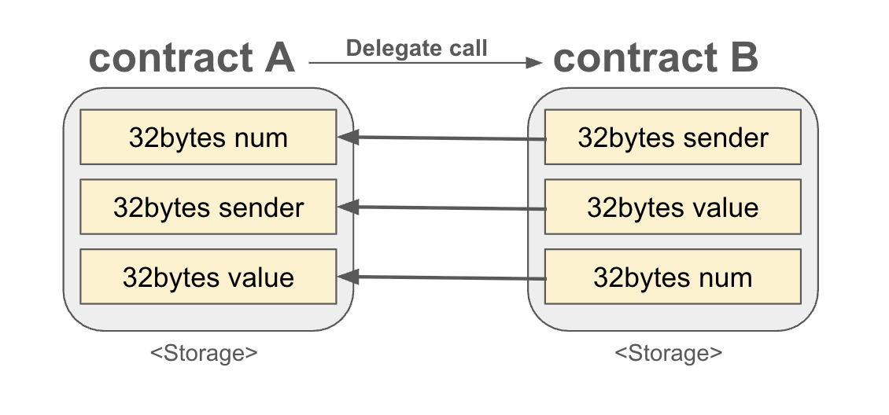

# Delegatecall

**delegatecall**은 이더리움 스마트 컨트랙트에서 하나의 컨트랙트가 다른 계약의 코드를 자신의 컨텍스트에서 실행하도록 한다. 

스마트 컨트랙트는 배포된 이후에는 코드를 변경할 수 없는 **불변성**을 가지고 있다. 이는 블록체인 기술의 핵심적인 특징으로, 신뢰성과 보안을 강화하는 데 기여하지만...
1. 컨트랙트에 버그가 있거나 새로운 기능을 추가해야 하는 경우에는 새로운 컨트랙트를 매번 다시 배포해야 한다. 
2. 기존 컨트랙트에 저장된 상태(state)를 새로운 컨트랙트로 옮기는 과정은 복잡하고, 데이터 손실, 오류 발생의 부담이 있다.
3. 새로운 컨트랙트의 배포와 데이터 이전은 추가적인 가스비용을 발생시킨다. 

이러한 문제를 해결하기 위해 등장한 것이 바로 **Delegatecall**이다. 
이는 이더리움 스마트 컨트랙트 개발에서 **코드 재사용**과 **업그레이드 가능한 스마트 컨트랙트 패턴**을 구현할 때 매우 유용하다. 


## `delegatecall` 작동방식

delegatecall은 스마트 컨트랙트가 다른 컨트랙트의 코드를 호출하면서도, **호출한 컨트랙트의 실행횐경(context)** 를 유지하도록 한다. 

A가 B의 컨트랙트를 delegatecall을 통해 호출하면, B의 컨트랙트가 **A의 관점에서 실행된다.** 즉, 호출된 컨트랙트 B의 코드는 **호출자 A의 storage**를 사용하여 실행된다. 

> **Context**  
>- smart contract가 실행되는 환경을 의미한다. 여기에는 **저장 공간(storage), 주소(msg.sender), 잔액(balance) 등이 포함**된다.   
>- `delegatecall`을 사용하면, 호출된 B는 호출한 A의 context에서 실행된다. 다시말해, A의 저장공간, 메시지(sender), balance등을 참조하며 실행된다. 

> **State**
>- `delegatecall`을 사용하면, 호출된 B가 자신의 상태를 변경하지 않고, 호출한 A의 상태를 변경한다. 

## call vs delegatecall

### 일반적인 call의 경우
- 컨트랙트 A가 컨트랙트 B를 호출하면, B의 코드가 B의 저장 공간에서 실행
- 결과적으로, **B의 상태(state)** 가 변하고, A의 상태는 그대로 유지된다

### delegatecall의 경우
- 컨트랙트 A가 컨트랙트 B를 호출하면서 **delegatecall**을 사용하면, **B의 코드는 실행되지만, 실행 환경(context)은 A의 저장 공간을 사용**한다.
- **B의 로직이 실행되면서 A의 상태(state)를 변경**한다. 

---
## 예제코드 전체
```solidity
// SPDX-License-Identifier: MIT
pragma solidity ^0.8.24;

// NOTE: Deploy this contract first
contract B {
    // NOTE: storage layout must be the same as contract A
    uint256 public num;
    address public sender;
    uint256 public value;

    function setVars(uint256 _num) public payable {
        num = _num;
        sender = msg.sender;
        value = msg.value;
    }
}

contract A {
    uint256 public num;
    address public sender;
    uint256 public value;

    function setVars(address _contract, uint256 _num) public payable {
        // A's storage is set, B is not modified.
        (bool success, bytes memory data) = _contract.delegatecall(
            abi.encodeWithSignature("setVars(uint256)", _num)
        );
    }
}
```

### contract B
```solidity
contract B {
    // NOTE: storage layout must be the same as contract A
    uint256 public num;
    address public sender;
    uint256 public value;

    function setVars(uint256 _num) public payable {
        num = _num;
        sender = msg.sender;
        value = msg.value;
    }
}
```
컨트랙트 A에 의해 호출된 컨트랙트 B이다. B 입장에서 보면, `setVars` 함수는 수를 인자로 받아 B 컨트랙트의 상태변수 `num`, `sender`, `value`의 값을 설정한다. 

### contract A
```solidity
contract A {
    uint256 public num;
    address public sender;
    uint256 public value;

    function setVars(address _contract, uint256 _num) public payable {
        (bool success, bytes memory data) = _contract.delegatecall(
            abi.encodeWithSignature("setVars(uint256)", _num)
        );
    }
}
```
A의 함수 `setVars`는 호출될 컨트랙트 B의 주소와, `_num`을 인자로 받아서, B를 delegatecall 한다. 

**정말 중요한 점!!!**   
반드시. A와 B의 state 선언의 타입과 순서가 똑같이 되어있어야한다.

예시는   
uint256 public num;  
address public sender;  
uint256 public value;  
이렇게 동일한 것을 확인할 수 있다. 그러나 만약, 

A에는   
uint256 public num;  
address public sender;  
uint256 public value;  
B에는    
address public sender;  
uint256 public value;  
uint256 public num;   
라고 선언되어있었다면,,,

 

`sender`에 들어갈 값이 `num`에, 
`value`에 들어갈 값이 `sender`에,
`num`에 들어갈 값이 `value`에 들어가게 된다.  

B의 로직은 자신의 저장 공간 레이아웃을 기준으로 데이터 저장위치를 결정하는데,
실제로는 A 저장공간 레이아웃에 따라 저장되기 때문에, 둘의 순서가 다르면, 엉뚱한 슬롯에 저장된다. 

호출된 B의 코드는 호출한 A의 저장소를 사용하므로, 
호출된 컨트랙트와 호출자의 저장소 슬롯 구조가 반드시 일치해야 한다.!!!


> remix에서 A와 B를 배포하고 A의 `setVars`함수를 호출하여, A와 B의 state 값들의 변화를 확인해보세요