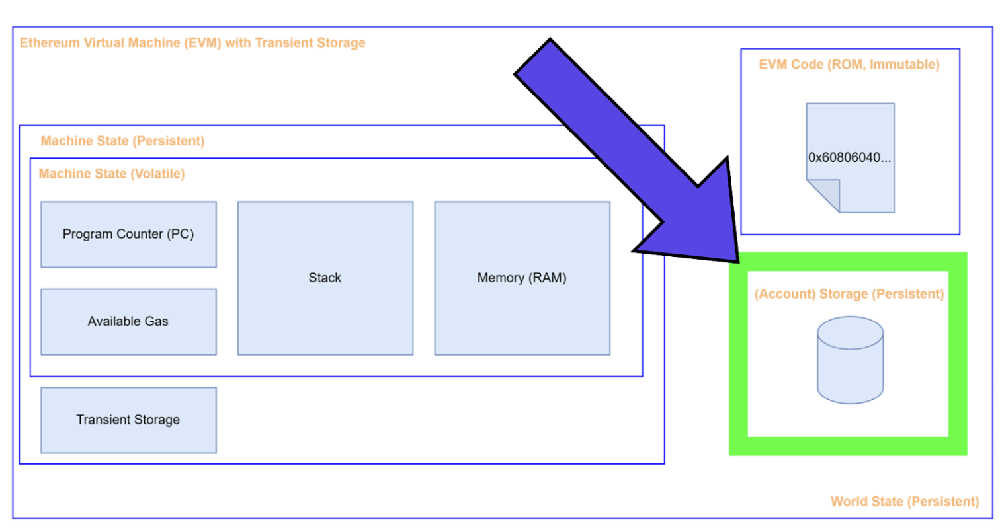
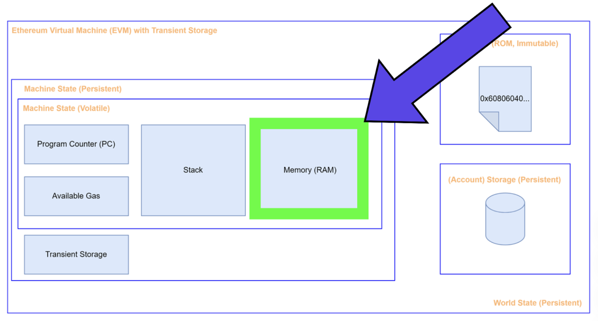
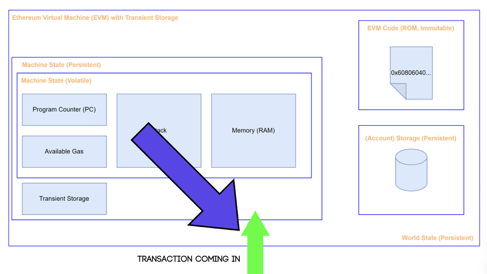
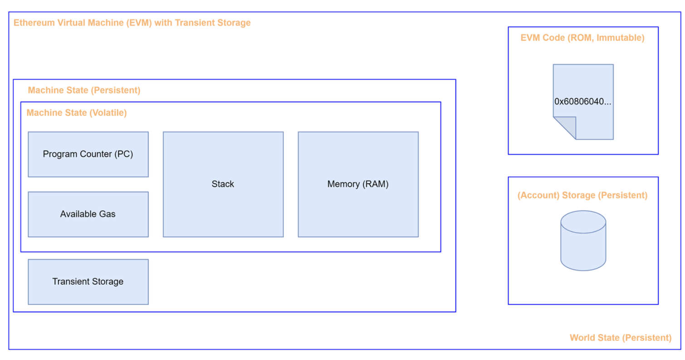

# Data Location

# 주요 저장소
data location은 변수 저장 및 처리 방식에 관한 개념으로, 효율성과 보안을 고려한 다양한 메모리 영역을 제공한다.

solidity에는 `storage` `memory` `calldata`의 세가지 주요 데이터 위치가 있다.

## **Storage**

- 특징: 상태 변수(State Variable)가 저장되는 공간. 영구적 저장소.
- 비용: 읽기와 쓰기가 비싸다
- 용도: 컨트랙트 상태 변수, 즉 컨트랙트가 종료되더라도 유지되어야 하는 데이터

## **Memory**

- 특징: 함수 실행 중 임시 데이터 저장소. 배열과 같은 큰 데이터를 저장.
- 비용: **읽기와 쓰기 모두** 상대적으로 저렴함(Stack 보다는 비쌈)
- 용도: 함수내에서 임시로 데이터를 저장하고 처리할 때

## Calldata

- 특징: 트랜잭션과 함께 **전달**된 데이터. **읽기만 가능**하며 수정 불가.
- 비용: 가스 비용이 적으며, 변경할 수 없음
- 용도: **외부 함수 호출 시 전달되는 인수**로, 값이 변경되지 않음을 보장할 때 사용

### 예제 코드
```solidity
// SPDX-License-Identifier: MIT
pragma solidity ^0.8.24;

contract DataLocations {
    uint256[] public arr;
    mapping(uint256 => address) public map;

    struct MyStruct {
        uint256 foo;
    }

    mapping(uint256 => MyStruct) public myStructs;

    // 상태 변수를 초기화하는 함수
    function initialize() public {
        arr.push(1);
        arr.push(2);
        arr.push(3);
        map[1] = msg.sender;
        myStructs[1] = MyStruct(42);
    }

    function f() public {
        // 상태 변수를 참조하여 _f 함수 호출
        _f(arr, map, myStructs[1]);

        // 매핑에서 구조체를 가져오기 (storage 위치)
        MyStruct storage myStruct = myStructs[1];
        // storage 구조체 값을 변경
        myStruct.foo = 100;

        // 메모리에 구조체 생성 (memory 위치)
        MyStruct memory myMemStruct = MyStruct(0);
        myMemStruct.foo = 200;
    }

    // storage 위치의 변수를 인수로 받는 내부 함수
    function _f(
        uint256[] storage _arr,
        mapping(uint256 => address) storage _map,
        MyStruct storage _myStruct
    ) internal {
        // storage 변수와 관련된 작업 수행
        _arr.push(4); // arr 배열에 값 추가
        _map[2] = msg.sender; // map에 새로운 키-값 쌍 추가
        _myStruct.foo = 50; // 구조체 값 변경
    }

    // memory 위치의 배열을 반환하는 함수
    function g(uint256[] memory _arr) public pure returns (uint256[] memory) {
        // memory 배열과 관련된 작업 수행
        uint256[] memory newArray = new uint256[](_arr.length);
        for (uint256 i = 0; i < _arr.length; i++) {
            newArray[i] = _arr[i] * 2;
        }
        return newArray;
    }

    // calldata 위치의 배열을 사용하는 외부 함수
    function h(uint256[] calldata _arr) external pure returns (uint256) {
        // calldata 배열과 관련된 작업 수행
        uint256 sum = 0;
        for (uint256 i = 0; i < _arr.length; i++) {
            sum += _arr[i];
        }
        return sum;
    }

    // 배열 길이를 반환하는 함수
    function getArrLength() public view returns (uint256) {
        return arr.length;
    }

    // 배열 요소를 반환하는 함수
    function getArrElement(uint256 index) public view returns (uint256) {
        require(index < arr.length, "Index out of bounds");
        return arr[index];
    }

    // 특정 구조체 값을 반환하는 함수
    function getMyStruct(uint256 key) public view returns (uint256) {
        return myStructs[key].foo;
    }
}
```

1. Storage 변수
- `arr` `map` `myStructs`는 모두 상태 변수로, 이들은 storage에 저장된다. 즉, 컨트랙트가 배포된 후에도 지속적으로 유지되는 데이터다.

2.  함수 f()

```solidity
function f() public {
        _f(arr, map, myStructs[1]);
        MyStruct storage myStruct = myStructs[1];
        MyStruct memory myMemStruct = MyStruct(0);
    }
```

- `_f(arr, map, myStructs[1]);`: storage 위치의 상태 변수를 인수로 전달한다.
- `MyStruct Storage myStruct = myStructs[1];`: storage에서 구조체를 가져와 참조를 저장한다.
- `MyStruct memory myMemStruct = MyStruct(0);`: 메모리에서 구조체를 생성한다. 이 구조체는 'f' 함수 실행중에만 존재함.

3. 내부 함수 _f()

```solidity
function _f(
  uint256[] storage _arr,
  mapping(uint256 => address) storage _map,
  MyStruct storage _myStruct
) internal{ ... }
```

- storage 위치의 변수를 인수로 받는다. 이는 `_f`함수가 호출될 때 전달된 상태 변수를 직접 수정할 수 있음을 의미한다.

4. 함수 g()

```solidity
function g(uint256[] memory _arr) public returns (uint256[] memory){ ... }
```

- memory 위치의 배열을 인수로 받고, memory 위치의 배열을 반환한다. 메모리에서 작업을 수행하며, 함수 실행 중에만 유효하다.

5. 함수 h()

```solidity
function h(uint256[] calldata _arr) external{ ... }
```

- calldata 위치의 배열을 인수로 받는다. calldata는 외부 호출 시 전달된 입력 데이터를 참조하는 읽기 전용 영역으로, 가스 비용이 적다.
---

# **Transient Storage**
Storage와 유사하지만, **현트랜잭션이 종료되면 데이터가 초기화**된다는 점에서 다르다. 

### **Transient Storage의 특성**

- **임시 저장**  
Transient Storage는 트랜잭션 동안만 존재하며, 트랜잭션이 끝나면 데이터가 0으로 초기화된다. 즉, 트랜잭션 범위 내에서만 유효하다.
- **저장 비용 없음**  
데이터가 블록체인에 영구적으로 저장되지 않으므로, 장기적인 저장 비용은 발생하지 않지만, 접근 및 저장하는 데 가스 비용이 발생한다. 구체적으로, `TSTORE`와 `TLOAD` 명령어를 사용할 때 각각 100 가스의 비용이 부과된다.  
    >- `TSTORE` (저장): 일시적 저장소에 데이터를 저장하는 작업이다. 데이터를 특정 키에 저장하며, 이 과정에서 100 가스의 비용이 발생한다.
    >- `TLOAD` (불러오기): 일시적 저장소에 저장된 데이터를 특정 키를 통해 불러오는 작업이다. 이 작업 역시 100 가스의 비용이 발생한다.
- **빠른 접근 속도**  
Transient Storage는 영구 저장소인 storage에 비해 상대적으로 접근 속도가 빠르며, 비용도 저렴하다.

## 이외의 데이터 저장소들 (참고)

EVM은 다양한  데이터 저장소를 활용하며, 각각의 저장소는 읽기/쓰기 가능 여부와 목적이 다르다. 



### **1. EVM이 데이터를 읽고 쓰는 위치**

- **`Stack`**: 함수 내부에서 사용되는 임시 데이터 저장소. 데이터를 push/pop 방식으로 관리하며, 가장 빠르고 저렴한 저장 방식. 크기 제한(256비트 단위) 때문에 큰 데이터는 저장 불가.
- **`Memory`**: 함수 실행 중 임시 데이터를 저장하는 공간. 배열과 같은 큰 데이터를 저장할 때 사용. 함수 종료 시 삭제됨.
- **`Storage`**: 영구적으로 데이터를 저장하는 공간. 상태 변수(State Variable)가 저장됨. 가스 비용이 가장 많이 듦.
- **`Transient Storage`**: EIP-1153에 따라 추가된 임시 저장소. 트랜잭션 종료 시 삭제되며, `TSTORE`와 `TLOAD`를 사용.
- **`Calldata`**: 트랜잭션과 함께 전달된 데이터. 읽기만 가능하며 수정 불가. 함수 파라미터로 사용될 때 효율적.
- **`Code`**: 컨트랙트의 코드 저장소. constant와 immutable 변수는 여기 저장되며 변경 불가.
- **`Return Data`**: 함수 호출 결과를 저장하는 공간.

### **2. EVM이 데이터를 쓸 수 있지만 읽을 수 없는 위치**

- **`Logs`**: 이벤트 데이터를 저장하는 공간. 트랜잭션 로그로 기록되며, 읽기는 불가능.

### **3. EVM이 데이터를 읽을 수 있지만 쓸 수 없는 위치**

- **`Transaction Data`**: 트랜잭션과 관련된 정보(예: 송신자 주소, 트랜잭션 값 등).
- **`Chain Data`**: 블록체인 관련 정보(예: 블록 번호, 타임스탬프 등).
- **`Gas Data`**: 가스 제한 및 가스 가격 정보.
- **기타 특정 데이터**: 매우 제한된 경우에만 접근 가능한 데이터.